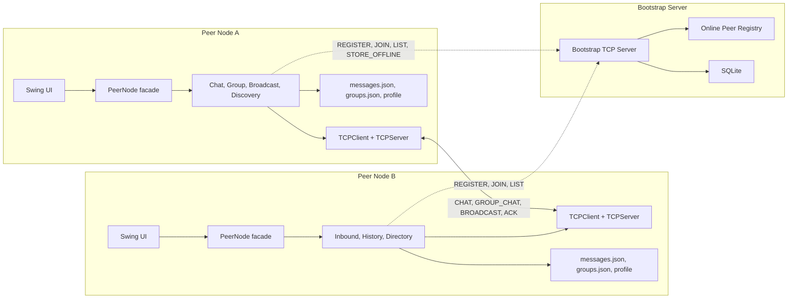
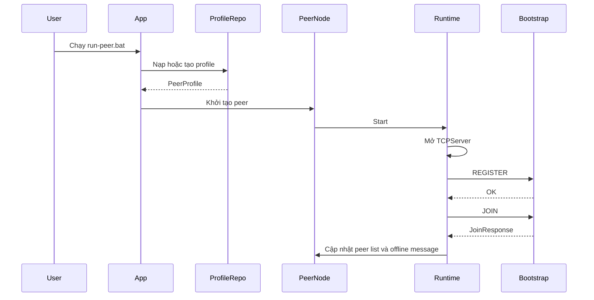

# BÁO CÁO ĐỒ ÁN: HỆ THỐNG CHAT NGANG HÀNG P2P

## CHƯƠNG 1: GIỚI THIỆU

### 1.1. Lý do chọn đề tài

Trong các hệ thống truyền thông hiện nay, mô hình client-server được sử dụng rất phổ biến. Ở mô hình này, toàn bộ tin nhắn thường được gửi lên một máy chủ trung tâm, sau đó máy chủ chuyển tiếp đến người nhận. Cách tiếp cận này dễ quản lý, dễ triển khai, nhưng cũng tạo ra một số hạn chế như phụ thuộc lớn vào máy chủ, tăng tải xử lý tại trung tâm và có nguy cơ gián đoạn toàn hệ thống nếu máy chủ gặp sự cố.

Mạng ngang hàng Peer-to-Peer là một hướng tiếp cận khác, trong đó mỗi nút mạng vừa đóng vai trò client, vừa đóng vai trò server. Các peer có thể kết nối và trao đổi dữ liệu trực tiếp với nhau thay vì luôn phải đi qua một máy chủ trung gian. Mô hình này phù hợp để nghiên cứu các đặc trưng của hệ thống phân tán như khám phá nút mạng, truyền thông giữa nhiều tiến trình, xử lý lỗi, đồng bộ trạng thái và đảm bảo độ tin cậy khi mạng không ổn định.

Đề tài xây dựng hệ thống chat P2P được lựa chọn vì bài toán có tính thực tế, dễ quan sát kết quả, nhưng vẫn bao phủ nhiều kiến thức cốt lõi của môn học hệ phân tán. Thông qua việc xây dựng hệ thống, nhóm có thể áp dụng TCP socket, cơ chế bootstrap/tracker, quản lý peer online/offline, ACK, timeout, retry, store-and-forward và mã hóa tin nhắn.

### 1.2. Mục tiêu đề tài

Mục tiêu chính của đề tài là xây dựng một hệ thống chat ngang hàng cho phép nhiều người dùng trao đổi tin nhắn trực tiếp với nhau trên mạng. Hệ thống cần có một bootstrap server đóng vai trò tracker để hỗ trợ peer discovery, nhưng việc gửi tin nhắn online giữa các peer phải được thực hiện trực tiếp qua TCP socket.

Các mục tiêu cụ thể gồm:

- Xây dựng peer node có khả năng vừa gửi tin, vừa lắng nghe và nhận tin từ peer khác.
- Xây dựng bootstrap server để đăng ký peer, quản lý danh sách peer online, hỗ trợ peer discovery và lưu tin nhắn offline.
- Cài đặt chức năng chat trực tiếp 1-1 giữa hai peer.
- Cài đặt chức năng chat nhóm bằng cách gửi tin đến từng thành viên trong nhóm.
- Cài đặt broadcast toàn mạng đến các peer đang online.
- Cài đặt cơ chế ACK, timeout và retry nhằm tăng độ tin cậy khi truyền tin.
- Cài đặt cơ chế store-and-forward khi peer nhận đang offline.
- Cài đặt mã hóa tin nhắn bằng khóa công khai của peer nhận.
- Lưu lịch sử tin nhắn và thông tin nhóm cục bộ theo từng profile người dùng.
- Kiểm thử các luồng chức năng chính bằng test tự động Maven.

### 1.3. Bài toán chat P2P

Bài toán đặt ra là xây dựng một hệ thống gồm nhiều peer. Mỗi peer là một tiến trình độc lập, có giao diện người dùng riêng, có định danh riêng và có cổng TCP riêng để nhận kết nối. Khi một peer khởi động, peer phải đăng ký thông tin với bootstrap server, bao gồm định danh, tên hiển thị, địa chỉ mạng, cổng lắng nghe và public key. Bootstrap server lưu thông tin này để các peer khác có thể tìm thấy nhau.

Khi người dùng gửi tin nhắn trực tiếp, peer gửi sẽ lấy thông tin peer nhận từ danh bạ hoặc từ bootstrap server, sau đó mở kết nối TCP trực tiếp đến IP và port của peer nhận. Peer nhận xử lý tin nhắn, lưu lịch sử cục bộ và trả về ACK cho peer gửi. Nếu không nhận được ACK trong thời gian quy định, peer gửi sẽ thử gửi lại. Nếu sau nhiều lần thử vẫn thất bại, tin nhắn có thể được lưu lên bootstrap server dưới dạng tin nhắn offline để peer nhận lấy lại khi online.

Đối với chat nhóm, nhóm được biểu diễn bằng metadata và danh sách thành viên. Khi gửi tin nhóm, peer gửi không gửi một gói duy nhất đến server trung tâm, mà tạo từng tin `GROUP_CHAT` riêng cho từng thành viên và gửi trực tiếp đến từng peer. Nếu một thành viên offline, tin nhắn dành cho thành viên đó được lưu offline trên bootstrap server.

Đối với broadcast toàn mạng, peer gửi lấy danh sách peer online hiện tại và gửi tin `BROADCAST` đến từng peer. Broadcast mang tính realtime, chỉ gửi cho peer đang online và không lưu offline.

### 1.4. Công nghệ sử dụng

Hệ thống được cài đặt bằng Java và tổ chức theo dạng Maven multi-module. Các công nghệ chính gồm:

| Công nghệ      | Vai trò                                                                    |
| ---------------- | --------------------------------------------------------------------------- |
| Java 21          | Ngôn ngữ lập trình chính cho peer node và bootstrap server.           |
| Maven            | Quản lý build, dependency và test cho toàn bộ project.                 |
| Java Swing       | Xây dựng giao diện desktop cho peer node.                                |
| TCP Socket       | Giao tiếp mạng trực tiếp giữa các peer và giữa peer với bootstrap. |
| Gson             | Serialize và deserialize dữ liệu JSON.                                   |
| SQLite           | Lưu dữ liệu bền vững phía bootstrap server.                           |
| sqlite-jdbc      | Driver JDBC để Java làm việc với SQLite.                               |
| JUnit 5          | Viết và chạy test tự động.                                            |
| Lombok           | Giảm mã lặp cho model và logging.                                       |
| SLF4J Simple     | Ghi log khi chạy hệ thống và khi kiểm thử.                            |
| Ikonli Swing     | Hỗ trợ icon cho giao diện Swing.                                         |
| RSA-OAEP SHA-256 | Mã hóa nội dung tin nhắn theo public key của peer nhận.               |

Project gồm hai module chính:

- `peer-node`: ứng dụng desktop của từng peer, gồm UI, TCP server, TCP client, service chat, service nhóm, broadcast, mã hóa và lưu trữ JSON cục bộ.
- `bootstrap-server`: tracker TCP độc lập, quản lý peer online trong RAM và lưu user, group, group member, offline message bằng SQLite.

### 1.5. Yêu cầu chức năng

Các yêu cầu chức năng chính của hệ thống gồm:

| Mã yêu cầu | Nội dung                             | Cách đáp ứng trong hệ thống                                                        |
| ------------- | ------------------------------------- | ---------------------------------------------------------------------------------------- |
| F1            | Peer tham gia mạng P2P               | Peer gửi `REGISTER` và `JOIN` đến bootstrap server khi khởi động.             |
| F2            | Peer discovery                        | Peer lấy danh sách peer online bằng `LIST` hoặc thông qua response của `JOIN`. |
| F3            | Chat trực tiếp 1-1                  | Peer gửi message loại `CHAT` trực tiếp qua TCP đến peer nhận.                   |
| F4            | Chat nhóm                            | Peer gửi `GROUP_CHAT` đến từng thành viên trong nhóm.                           |
| F5            | Broadcast toàn mạng                 | Peer gửi `BROADCAST` đến các peer đang online.                                    |
| F6            | Quản lý trạng thái online/offline | Bootstrap server lưu registry online trong RAM và loại peer quá hạn TTL.            |
| F7            | Lưu lịch sử tin nhắn              | Peer lưu tin nhắn cục bộ vào `messages.json` theo profile.                        |
| F8            | Quản lý nhóm                       | Bootstrap lưu metadata nhóm, peer lưu cache nhóm vào `groups.json`.               |
| F9            | Lưu profile người dùng            | Mỗi peer có `peer.id`, tên, port, public key và private key riêng.                |
| F10           | Giao diện người dùng              | Peer node có giao diện Swing để chọn profile, xem danh sách chat và gửi tin.     |

### 1.6. Yêu cầu nâng cao

Ngoài các chức năng cơ bản, hệ thống đã cài đặt các yêu cầu nâng cao sau:

| Yêu cầu nâng cao   | Nội dung thực hiện                                                                        |
| --------------------- | -------------------------------------------------------------------------------------------- |
| ACK                   | Receiver trả về message `ACK` có cùng `message.id` để xác nhận đã nhận tin.   |
| Timeout               | TCP client đặt connect timeout 2000 ms và read timeout 3000 ms.                           |
| Retry                 | Sender thử gửi tối đa 3 lần, cách nhau 300 ms, nếu chưa nhận ACK hợp lệ.          |
| Store-and-forward     | Tin direct/group thất bại được lưu lên bootstrap và giao lại khi receiver `JOIN`. |
| Encryption            | Nội dung tin nhắn được mã hóa RSA-OAEP SHA-256 theo public key của receiver.         |
| Broadcast realtime    | Gửi tin đến toàn bộ peer online trong conversation riêng `[Thế giới]`.             |
| Local runtime data    | Dữ liệu phát sinh được tách khỏi source code, đặt trong `runtime-data/`.         |
| Kiểm thử tự động | Dùng Maven và JUnit 5 để kiểm thử bootstrap, peer integration, profile và history.    |

## CHƯƠNG 2: CƠ SỞ LÝ THUYẾT

### 2.1. Mô hình mạng ngang hàng Peer-to-Peer

Mạng ngang hàng Peer-to-Peer là mô hình mạng trong đó các nút tham gia có vai trò tương đương nhau. Mỗi nút có thể cung cấp tài nguyên, nhận tài nguyên, gửi dữ liệu và nhận dữ liệu. Khác với mô hình client-server truyền thống, P2P không bắt buộc mọi dữ liệu phải đi qua một máy chủ trung tâm.

Trong hệ thống chat P2P, mỗi peer có hai vai trò đồng thời:

- Vai trò client: khi người dùng gửi tin nhắn, peer mở kết nối đến peer nhận.
- Vai trò server: peer mở TCP server trên một port riêng để nhận tin nhắn từ peer khác.

Ưu điểm của mô hình P2P:

- Giảm tải cho server trung tâm vì tin nhắn online đi trực tiếp giữa các peer.
- Phù hợp với hệ thống phân tán, nơi các node tự phối hợp với nhau.
- Dễ mở rộng ở mức giao tiếp trực tiếp giữa nhiều nút.
- Giúp minh họa rõ các vấn đề của mạng phân tán như peer rời mạng, peer mất kết nối, đồng bộ danh sách node.

Nhược điểm của mô hình P2P:

- Cần cơ chế peer discovery để các peer tìm thấy nhau.
- Cần xử lý peer offline và địa chỉ mạng thay đổi.
- Khó triển khai qua NAT hoặc firewall nếu không có cơ chế NAT traversal.
- Cần cơ chế đảm bảo tin nhắn được nhận, tránh mất tin do lỗi mạng.

Trong project này, mô hình P2P được triển khai theo dạng có bootstrap server hỗ trợ. Bootstrap không relay tin nhắn online, mà chỉ lưu thông tin cần thiết để các peer tự kết nối.

### 2.2. Bootstrap/Tracker trong mạng Peer-to-Peer

Trong mạng P2P, một peer mới tham gia thường chưa biết địa chỉ của các peer khác. Vì vậy hệ thống cần một điểm khởi đầu để peer đăng ký và lấy danh sách peer online. Thành phần này thường được gọi là bootstrap server hoặc tracker.

Vai trò của bootstrap server trong hệ thống:

- Nhận thông tin đăng ký của peer thông qua `REGISTER`.
- Đánh dấu peer online thông qua `JOIN`.
- Trả danh sách peer online thông qua `JOIN` và `LIST`.
- Đánh dấu peer rời mạng thông qua `LEAVE`.
- Lưu public key của peer để peer khác có thể mã hóa tin nhắn.
- Lưu metadata nhóm và danh sách thành viên nhóm.
- Lưu tin nhắn offline khi peer nhận không thể nhận trực tiếp.

Bootstrap server trong project này vẫn là một thành phần trung tâm, nhưng phạm vi trách nhiệm được giới hạn. Nó không xử lý giao diện, không định tuyến tin nhắn online và không đọc nội dung plaintext của tin nhắn đã mã hóa. Nhờ đó, hệ thống vẫn giữ được tinh thần P2P ở luồng truyền tin chính.

Trạng thái online của peer được bootstrap quản lý bằng một registry trong RAM. Mỗi lần peer `JOIN`, thời điểm `lastSeen` được cập nhật. Nếu peer không tiếp tục refresh trong một khoảng thời gian, bootstrap loại peer khỏi danh sách online. Trong mã nguồn hiện tại, TTL online là 15 giây.

### 2.3. Giao tiếp TCP Socket và giao thức trao đổi thông điệp

TCP socket là cơ chế truyền thông tin cậy theo kết nối. Khi gửi tin, bên gửi mở socket đến địa chỉ IP và port của bên nhận. Hai bên có thể ghi và đọc dữ liệu qua stream. TCP đảm bảo thứ tự byte trong cùng một kết nối, nhưng ở tầng ứng dụng vẫn cần định nghĩa định dạng thông điệp, timeout, ACK và cách xử lý khi đối phương không phản hồi.

Trong hệ thống này có hai loại giao thức:

Thứ nhất là giao thức peer-to-peer giữa các peer. Mỗi request là một dòng JSON biểu diễn object `Message`, kết thúc bằng ký tự xuống dòng. Receiver đọc một dòng, deserialize thành `Message`, xử lý theo `MessageType`, sau đó trả về một dòng JSON response. Với tin nhắn chat, response hợp lệ là `ACK` có cùng `message.id`.

Các loại message P2P chính:

| MessageType                        | Ý nghĩa                                               |
| ---------------------------------- | ------------------------------------------------------- |
| `CHAT`                           | Tin nhắn trực tiếp 1-1.                              |
| `GROUP_CHAT`                     | Tin nhắn nhóm gửi đến một thành viên cụ thể.  |
| `BROADCAST`                      | Tin broadcast realtime đến peer online.               |
| `PEER_LIST_REQUEST`              | Yêu cầu một peer trả danh sách peer mà nó biết. |
| `PEER_LIST_RESPONSE`             | Phản hồi danh sách peer.                             |
| `GROUP_MEMBERS_SYNC`             | Đồng bộ thành viên nhóm giữa các peer.          |
| `JOIN`, `LEAVE`, `HEARTBEAT` | Message điều khiển trạng thái peer.                |
| `ACK`                            | Xác nhận đã xử lý message.                        |

Thứ hai là giao thức giữa peer và bootstrap server. Request là một dòng text theo dạng:

```text
COMMAND [JSON_PAYLOAD]
```

Các command bootstrap chính:

| Command                 | Ý nghĩa                                                      |
| ----------------------- | -------------------------------------------------------------- |
| `REGISTER`            | Lưu hoặc cập nhật thông tin user, public key.             |
| `JOIN`                | Đánh dấu peer online, trả danh sách peer và tin offline. |
| `LEAVE`               | Xóa peer khỏi registry online.                               |
| `LIST`                | Trả danh sách peer online.                                   |
| `STORE_OFFLINE`       | Lưu tin nhắn offline cho receiver.                           |
| `CREATE_GROUP`        | Tạo hoặc cập nhật metadata nhóm.                          |
| `ADD_GROUP_MEMBER`    | Thêm thành viên vào nhóm.                                 |
| `REMOVE_GROUP_MEMBER` | Xóa thành viên khỏi nhóm.                                 |
| `LIST_GROUPS`         | Lấy danh sách nhóm.                                         |
| `LIST_GROUP_MEMBERS`  | Lấy danh sách thành viên của một nhóm.                  |

### 2.4. Cơ chế đảm bảo độ tin cậy và an toàn tin nhắn

TCP đã cung cấp độ tin cậy ở tầng truyền tải, nhưng ứng dụng vẫn cần biết liệu message đã được peer nhận xử lý hay chưa. Vì vậy hệ thống sử dụng ACK ở tầng ứng dụng. Mỗi message có một UUID. Khi receiver xử lý xong, receiver trả về `ACK` có cùng UUID. Sender chỉ coi gửi thành công khi response không null, có type `ACK` và id trùng với request.

Cơ chế retry được áp dụng khi sender không nhận được ACK hợp lệ. Sender thử gửi tối đa 3 lần. Mỗi lần gửi dùng TCP client với connect timeout 2000 ms và read timeout 3000 ms. Giữa các lần retry có khoảng nghỉ 300 ms để tránh gửi dồn dập.

Khi gửi trực tiếp thất bại, hệ thống dùng store-and-forward cho direct message và group message. Sender gửi command `STORE_OFFLINE` đến bootstrap server, kèm nội dung tin nhắn, receiver id, group id nếu có và metadata mã hóa. Khi receiver online lại và gửi `JOIN`, bootstrap trả về danh sách tin offline đang chờ. Sau khi trả, bootstrap đánh dấu các tin này đã giao.

Về an toàn nội dung, hệ thống sử dụng mã hóa RSA theo từng receiver. Mỗi profile peer có một cặp khóa public/private. Public key được gửi lên bootstrap và chia sẻ trong `PeerInfo`; private key chỉ lưu cục bộ trong profile của peer. Khi gửi tin, sender mã hóa content bằng public key của receiver. Receiver dùng private key của mình để giải mã trước khi lưu vào lịch sử. Offline message trên bootstrap vẫn là ciphertext, do đó bootstrap không cần biết nội dung gốc.

Thông số mã hóa chính:

| Thành phần                     | Giá trị                                              |
| -------------------------------- | ------------------------------------------------------ |
| Thuật toán khóa               | RSA                                                    |
| Kích thước khóa              | 2048 bit                                               |
| Cipher                           | `RSA/ECB/OAEPWithSHA-256AndMGF1Padding`              |
| Nhãn thuật toán trong message | `RSA-OAEP-SHA256`                                    |
| Cách xử lý tin dài           | Chia content thành nhiều chunk trước khi mã hóa. |

## CHƯƠNG 3: PHÂN TÍCH VÀ THIẾT KẾ HỆ THỐNG

### 3.1. Phân tích yêu cầu hệ thống

Hệ thống cần đáp ứng các nhóm yêu cầu sau:

Nhóm yêu cầu về peer:

- Mỗi peer có định danh ổn định `peer.id`.
- Mỗi peer có tên hiển thị để người dùng dễ nhận biết.
- Mỗi peer có địa chỉ host và port runtime để peer khác kết nối.
- Mỗi peer có TCP server để nhận tin nhắn.
- Mỗi peer có TCP client để gửi tin nhắn.
- Mỗi peer có local storage để lưu profile, lịch sử chat và danh sách nhóm.

Nhóm yêu cầu về bootstrap:

- Bootstrap phải chạy độc lập với peer node.
- Bootstrap lắng nghe TCP trên port mặc định 9000.
- Bootstrap lưu user, public key, group, group member và offline message trong SQLite.
- Bootstrap quản lý danh sách peer online trong RAM.
- Bootstrap trả danh sách peer online để hỗ trợ discovery.
- Bootstrap hỗ trợ store-and-forward khi peer offline.

Nhóm yêu cầu về truyền thông:

- Tin nhắn online giữa các peer phải đi trực tiếp qua TCP socket.
- Tin nhắn cần có định danh duy nhất để ACK và chống duplicate.
- Sender phải kiểm tra ACK, timeout và retry.
- Tin nhắn direct/group thất bại cần có đường lưu offline.
- Broadcast chỉ gửi realtime cho peer online.

Nhóm yêu cầu về bảo mật:

- Không gửi plaintext nếu receiver có public key hợp lệ để mã hóa.
- Private key không được gửi lên bootstrap.
- Offline message được lưu dưới dạng encrypted content khi tin đã mã hóa.

### 3.2. Kiến trúc tổng quan hệ thống

Hệ thống gồm hai loại tiến trình chính: nhiều peer node và một bootstrap server. Các peer giao tiếp trực tiếp với nhau khi chat online. Bootstrap server chỉ hỗ trợ discovery, trạng thái online/offline, metadata nhóm và lưu tin offline.



Nguyên tắc thiết kế chính là tách rõ trách nhiệm. Peer node chịu trách nhiệm xử lý nghiệp vụ người dùng và truyền tin P2P. Bootstrap server chịu trách nhiệm theo dõi trạng thái và dữ liệu hỗ trợ. Cách tách này giúp giảm phụ thuộc vào server trung tâm trong luồng chat online.

### 3.3. Thiết kế thành phần Peer Node

`peer-node` là module đại diện cho một người dùng trong mạng. Khi chạy, peer node mở giao diện Swing, tạo hoặc nạp profile, khởi động TCP server, đăng ký với bootstrap và bắt đầu nhận/gửi tin nhắn.

Các thành phần chính của peer node:

| Thành phần                    | Trách nhiệm                                                                         |
| ------------------------------- | ------------------------------------------------------------------------------------- |
| `App`                         | Parse tham số chạy, chọn/tạo profile, khởi động peer và UI.                   |
| `PeerNode`                    | Facade để UI gọi các chức năng chat, group, broadcast, discovery và lifecycle. |
| `PeerNodeFactory`             | Lắp ráp service, repository, gateway, TCP client/server và encryption service.     |
| `PeerNodeRuntime`             | Quản lý vòng đời TCP server và vòng đồng bộ bootstrap.                      |
| `TCPServer`                   | Lắng nghe kết nối đến từ peer khác.                                            |
| `ConnectionHandler`           | Xử lý từng socket được accept và trả response.                                |
| `TCPClient`                   | Mở socket đến peer đích, gửi message và đọc response.                        |
| `MessageSender`               | Bọc logic retry và kiểm tra ACK.                                                   |
| `MessageReceiver`             | Nhận message đến và chuyển cho router xử lý.                                   |
| `MessageRouterImpl`           | Phân loại message theo `MessageType`.                                             |
| `InboundMessageImpl`          | Giải mã, lưu message đến và notify UI.                                          |
| `ChatImpl`                    | Gửi direct chat và xử lý fallback offline.                                        |
| `GroupChatImpl`               | Tạo nhóm, đồng bộ nhóm và gửi tin nhóm đến từng member.                   |
| `NetworkBroadcastImpl`        | Gửi broadcast đến các peer online.                                                |
| `PeerDirectoryImpl`           | Lưu danh bạ peer đã biết và trạng thái online.                                |
| `BootstrapSyncImpl`           | Register, join, refresh peer, lấy offline message và sync group.                    |
| `LocalMessageRepo`            | Lưu lịch sử tin nhắn cục bộ bằng JSON.                                         |
| `LocalGroupRepo`              | Lưu group cache cục bộ bằng JSON.                                                 |
| `PeerProfileRepository`       | Quản lý profile, key pair và thư mục runtime.                                    |
| `RsaMessageEncryptionService` | Mã hóa và giải mã content tin nhắn.                                             |

Peer node sử dụng `peer.id` làm định danh ổn định. Host và port chỉ là địa chỉ runtime, có thể thay đổi theo lần chạy. Việc tách định danh và địa chỉ giúp nhóm và lịch sử chat vẫn gắn với đúng người dùng ngay cả khi cổng hoặc IP thay đổi.

### 3.4. Thiết kế thành phần Bootstrap Server

`bootstrap-server` là tracker TCP chạy độc lập. Server nhận request dạng một dòng text, phân tích command và JSON payload, sau đó gọi `PeerRegistry` hoặc các repository tương ứng.

Các thành phần chính:

| Thành phần           | Trách nhiệm                                                         |
| ---------------------- | --------------------------------------------------------------------- |
| `BootstrapServer`    | Mở ServerSocket, nhận command và trả response.                    |
| `PeerRegistry`       | Quản lý peer online trong RAM, TTL, offline drain và group lookup. |
| `UserRepo`           | Lưu thông tin user và public key.                                  |
| `GroupRepo`          | Lưu metadata nhóm.                                                  |
| `GroupMemberRepo`    | Lưu quan hệ group-member.                                           |
| `OfflineMessageRepo` | Lưu tin nhắn offline và đánh dấu delivered.                     |
| `Conn`               | Tạo kết nối SQLite.                                                |
| `Init`               | Khởi tạo schema database.                                           |
| `Config`             | Đọc cấu hình port và đường dẫn database.                     |

Bootstrap server dùng cached thread pool để xử lý nhiều kết nối đồng thời. Mỗi request từ peer được xử lý độc lập, giúp các peer có thể register, join, list và store offline cùng lúc.

Bootstrap lưu dữ liệu bền vững trong SQLite với đường dẫn mặc định:

```text
runtime-data/bootstrap-server/bootstrap-server.db
```

Trạng thái online không lưu bền vững trong database mà được giữ trong RAM. Điều này phù hợp vì online/offline là trạng thái runtime. Khi bootstrap khởi động lại, các peer cần `JOIN` lại để cập nhật trạng thái.

### 3.5. Thiết kế mô hình dữ liệu

Các model dữ liệu chính của hệ thống gồm:

| Model               | Thuộc tính chính                                                                                                | Ý nghĩa                                              |
| ------------------- | ------------------------------------------------------------------------------------------------------------------ | ------------------------------------------------------ |
| `PeerInfo`        | `id`, `name`, `host`, `port`, `online`, `publicKey`                                                    | Thông tin định danh và địa chỉ của peer.       |
| `Message`         | `id`, `type`, `senderId`, `receiverId`, `groupId`, `content`, `encrypted`, `timestamp`, `status` | Gói tin dùng cho chat, group, broadcast và control. |
| `Group`           | `groupId`, `name`, `members`                                                                                 | Nhóm chat cục bộ ở peer.                           |
| `OfflineMessage`  | `messageId`, `senderId`, `receiverId`, `groupId`, `content`, `encrypted`                               | Tin nhắn chờ giao trên bootstrap.                   |
| `PeerProfile`     | `peer.id`, `peer.name`, `peer.port`, `publicKey`, `privateKey`                                           | Hồ sơ local của người dùng.                      |
| `BroadcastResult` | `total`, `delivered`, `failed`                                                                               | Kết quả gửi broadcast.                              |

Schema SQLite phía bootstrap gồm bốn bảng chính:

| Bảng                | Nội dung                                                                                                                                                                  |
| -------------------- | -------------------------------------------------------------------------------------------------------------------------------------------------------------------------- |
| `users`            | Lưu `user_id`, `display_name`, `public_key`, `created_at`, `updated_at`.                                                                                        |
| `groups`           | Lưu `group_id`, `name`, `created_by`, `created_at`.                                                                                                               |
| `group_members`    | Lưu quan hệ `group_id`, `user_id`, `joined_at`.                                                                                                                    |
| `offline_messages` | Lưu `message_id`, `sender_id`, `receiver_id`, `group_id`, `content`, `created_at`, `delivered`, `encrypted`, `encryption_algorithm`, `encrypted_for`. |

Ở phía peer, dữ liệu runtime được lưu theo profile:

```text
runtime-data/
├── peer-node/
│   ├── config.properties
│   └── <profile-id>/
│       ├── config.properties
│       ├── messages.json
│       └── groups.json
└── bootstrap-server/
    └── bootstrap-server.db
```

### 3.6. Thiết kế giao thức trao đổi thông điệp

#### 3.6.1. Giao thức peer-to-peer

Peer gửi một object `Message` dưới dạng JSON qua TCP. Mỗi message có `id` duy nhất để đối chiếu ACK.

Cấu trúc khái quát:

```json
{
  "id": "uuid",
  "type": "CHAT",
  "senderId": "alice",
  "senderHost": "192.168.0.23",
  "senderPort": 5001,
  "senderPublicKey": "...",
  "receiverId": "bob",
  "receiverHost": "192.168.0.23",
  "receiverPort": 5002,
  "groupId": null,
  "groupName": null,
  "content": "encrypted-or-plain-content",
  "encrypted": true,
  "encryptionAlgorithm": "RSA-OAEP-SHA256",
  "encryptedFor": "bob",
  "timestamp": 1710000000000,
  "status": "SENT"
}
```

Điều kiện ACK hợp lệ:

```text
response != null
response.type == ACK
response.id == request.id
```

Với discovery fallback, sender gửi `PEER_LIST_REQUEST` và mong nhận `PEER_LIST_RESPONSE` có cùng id. Response chứa danh sách peer mà peer nhận đang biết.

#### 3.6.2. Giao thức peer-bootstrap

Bootstrap protocol dùng command text để đơn giản hóa việc xử lý. Peer mở socket đến bootstrap, gửi một dòng command và đọc một dòng response.

Ví dụ:

```text
REGISTER {"id":"alice","name":"Alice","host":"192.168.0.23","port":5001,"publicKey":"..."}
JOIN {"id":"alice","name":"Alice","host":"192.168.0.23","port":5001,"publicKey":"..."}
LIST
STORE_OFFLINE {"messageId":"...","senderId":"alice","receiverId":"bob","content":"..."}
```

Response của `JOIN` là object chứa danh sách peer online và danh sách offline message dành cho peer vừa join.

### 3.7. Thiết kế các luồng xử lý chính

#### 3.7.1. Luồng khởi động và tham gia mạng

Khi người dùng chạy peer node, hệ thống thực hiện các bước:

1. `App` đọc tham số dòng lệnh như `--profile`, `--peer-name`, `--peer-port`, `--data-dir`.
2. `PeerProfileRepository` nạp profile cũ hoặc tạo profile mới.
3. Nếu profile mới, hệ thống sinh `peer.id`, chọn port và tạo RSA key pair.
4. `PeerNodeFactory` tạo các repository, service, TCP client/server và encryption service.
5. `PeerNodeRuntime` khởi động `TCPServer` trên port của peer.
6. Peer gửi `REGISTER` đến bootstrap để lưu user và public key.
7. Peer gửi `JOIN` đến bootstrap để đánh dấu online.
8. Bootstrap trả danh sách peer online và offline message đang chờ.
9. Peer cập nhật `PeerDirectory`, xử lý offline message và đồng bộ group.
10. Peer tiếp tục refresh định kỳ bằng `JOIN` để giữ trạng thái online.



#### 3.7.2. Luồng chat trực tiếp 1-1

Luồng gửi direct chat:

1. Người dùng chọn peer nhận và nhập nội dung.
2. UI gọi `PeerNode.sendMessage`.
3. `ChatImpl` lấy thông tin peer nhận từ directory hoặc bootstrap.
4. Hệ thống tạo `Message` loại `CHAT` với UUID mới.
5. `RsaMessageEncryptionService` mã hóa content bằng public key của receiver.
6. `MessageSender` gửi message đến host:port của receiver.
7. Receiver đọc JSON, route đến `InboundMessageImpl`.
8. Receiver giải mã content bằng private key local.
9. Receiver lưu message vào `messages.json`.
10. Receiver trả `ACK` cùng id.
11. Sender nhận ACK, đánh dấu message `SENT` và lưu lịch sử local.

Nếu sender không nhận ACK, message được retry. Nếu retry thất bại, sender cố lưu offline lên bootstrap và đánh dấu trạng thái phù hợp.

#### 3.7.3. Luồng chat nhóm

Luồng chat nhóm:

1. Người dùng tạo nhóm hoặc chọn nhóm đã có.
2. Group metadata được lưu cục bộ và đồng bộ lên bootstrap.
3. Khi gửi tin, `GroupChatImpl` lấy danh sách member của nhóm.
4. Hệ thống loại peer gửi ra khỏi danh sách nhận.
5. Với mỗi member, hệ thống resolve `peer.id` sang host, port và public key mới nhất.
6. Tạo một `GROUP_CHAT` riêng cho từng member.
7. Mã hóa content bằng public key của chính member đó.
8. Gửi trực tiếp đến từng peer qua TCP.
9. Member online nhận, giải mã, lưu message vào conversation group.
10. Member offline được lưu tin riêng trên bootstrap thông qua `STORE_OFFLINE`.

Cách gửi riêng từng member giúp ACK rõ ràng theo từng người nhận và giúp mã hóa đúng khóa công khai của từng peer.

#### 3.7.4. Luồng broadcast toàn mạng

Luồng broadcast:

1. Người dùng gửi tin ở conversation `[Thế giới]`.
2. `NetworkBroadcastImpl` gọi bootstrap `LIST` để lấy danh sách peer online.
3. Hệ thống merge với danh bạ local và loại peer hiện tại.
4. Hệ thống loại peer thiếu host/port hoặc đang offline.
5. Với mỗi peer online, tạo message `BROADCAST`.
6. Gửi trực tiếp đến từng peer qua TCP và chờ ACK.
7. Lưu kết quả gửi gồm tổng số peer, số peer nhận thành công và số peer lỗi.
8. Lưu lịch sử broadcast ở conversation key `__broadcast__`.

Broadcast không lưu offline. Đây là hành vi có chủ ý vì broadcast được xem là thông báo realtime toàn mạng.

#### 3.7.5. Luồng store-and-forward khi peer offline

Store-and-forward xử lý trường hợp peer nhận không online hoặc không phản hồi.

Luồng xử lý:

1. Sender gửi direct/group message qua TCP.
2. Nếu kết nối lỗi, timeout hoặc ACK không hợp lệ, sender retry tối đa 3 lần.
3. Nếu vẫn thất bại, sender tạo offline message.
4. Sender gửi `STORE_OFFLINE` đến bootstrap.
5. Bootstrap lưu message vào bảng `offline_messages`, trạng thái `delivered = 0`.
6. Khi receiver online lại, receiver gửi `JOIN`.
7. Bootstrap tìm offline message theo `receiverId`.
8. Bootstrap trả danh sách tin offline trong `JoinResponse`.
9. Bootstrap đánh dấu các tin đã trả là delivered.
10. Receiver giải mã, lưu lịch sử local và hiển thị trong UI.

Store-and-forward không biến bootstrap thành chat server trung tâm, vì bootstrap chỉ lưu tạm tin khi không thể giao trực tiếp. Với tin online, nội dung vẫn đi peer-to-peer.

## CHƯƠNG 4: CÀI ĐẶT, KIỂM THỬ VÀ ĐÁNH GIÁ

### 4.1. Môi trường cài đặt

Môi trường cài đặt và kiểm thử:

| Thành phần                | Giá trị        |
| --------------------------- | ---------------- |
| Hệ điều hành kiểm thử | Windows          |
| JDK                         | Java 21          |
| Build tool                  | Maven 3.9+       |
| Bootstrap port mặc định  | 9000             |
| Peer port demo              | 5001, 5002, 5003 |
| Database bootstrap          | SQLite           |
| UI                          | Java Swing       |
| Lệnh kiểm thử            | `mvn test`     |

Các script hỗ trợ chạy nhanh:

| Script                | Chức năng                                         |
| --------------------- | --------------------------------------------------- |
| `run-bootstrap.bat` | Chạy bootstrap server.                             |
| `run-peer.bat`      | Chạy một peer node.                               |
| `run-all-peers.bat` | Chạy bootstrap và ba peer demo Alice, Bob, Carol. |

### 4.2. Cấu trúc project

Cấu trúc thư mục chính:

```text
p2p/
├── bootstrap-server/
│   ├── pom.xml
│   └── src/
│       ├── main/java/dungcony/ds/
│       └── test/java/dungcony/ds/
├── peer-node/
│   ├── pom.xml
│   └── src/
│       ├── main/java/dungcony/ds/
│       └── test/java/dungcony/ds/
├── docs/
├── public/
├── runtime-data/
├── pom.xml
├── run-bootstrap.bat
├── run-peer.bat
└── run-all-peers.bat
```

Vai trò các thư mục:

| Thư mục/file         | Vai trò                                                |
| ---------------------- | ------------------------------------------------------- |
| `pom.xml`            | Parent Maven POM, khai báo hai module.                 |
| `bootstrap-server/`  | Source code tracker TCP và SQLite repository.          |
| `peer-node/`         | Source code ứng dụng peer và UI Swing.               |
| `docs/`              | Tài liệu yêu cầu, thiết kế và báo cáo.         |
| `runtime-data/`      | Dữ liệu phát sinh khi chạy, không commit lên git. |
| `public/images/app/` | Hình ảnh dùng cho ứng dụng.                        |

### 4.3. Cài đặt các chức năng chính

#### 4.3.1. Cài đặt peer discovery

Peer discovery được cài đặt dựa trên bootstrap server. Khi peer khởi động, peer gửi `REGISTER` để lưu thông tin user và gửi `JOIN` để đánh dấu online. Bootstrap trả về danh sách peer online hiện tại. Peer lưu danh sách này vào `PeerDirectoryImpl`.

Trong quá trình chạy, peer có vòng đồng bộ bootstrap định kỳ. Vòng này giúp peer cập nhật trạng thái online/offline mới nhất và duy trì `lastSeen` trên bootstrap. Nếu bootstrap không khả dụng, peer vẫn có thể giữ danh bạ local đã biết và tiếp tục chat với peer còn kết nối được trực tiếp.

Hệ thống cũng có message `PEER_LIST_REQUEST` và `PEER_LIST_RESPONSE` để hỗ trợ fallback discovery qua peer đã biết.

#### 4.3.2. Cài đặt chat trực tiếp

Chat trực tiếp được cài đặt trong `ChatImpl`, `MessageSender`, `TCPClient`, `TCPServer`, `ConnectionHandler` và `InboundMessageImpl`.

Khi gửi tin:

- Tạo message `CHAT`.
- Mã hóa content theo public key của receiver.
- Gửi message qua TCP đến receiver.
- Chờ `ACK`.
- Nếu thành công, lưu lịch sử local với trạng thái `SENT`.
- Nếu thất bại, retry rồi fallback sang store offline nếu có thể.

Khi nhận tin:

- TCP server accept socket.
- `ConnectionHandler` đọc một dòng JSON.
- `MessageReceiver` chuyển message cho router.
- `InboundMessageImpl` giải mã content, lưu history và trả ACK.

#### 4.3.3. Cài đặt chat nhóm

Chat nhóm được cài đặt trong `GroupChatImpl` và `GroupManager`. Metadata nhóm được lưu ở cả peer local và bootstrap để các peer có thể đồng bộ lại sau khi chạy lại.

Khi gửi tin nhóm, hệ thống không gửi lên bootstrap để relay. Thay vào đó, sender gửi trực tiếp đến từng thành viên. Với mỗi member, hệ thống tạo một message `GROUP_CHAT` riêng, đặt `receiverId`, `receiverHost`, `receiverPort`, `groupId`, `groupName`, sau đó mã hóa content theo public key của member.

Nếu member online, member nhận tin qua TCP. Nếu member offline, message dành cho member đó được lưu vào offline store trên bootstrap.

#### 4.3.4. Cài đặt broadcast

Broadcast được cài đặt trong `NetworkBroadcastImpl`. Broadcast dùng conversation đặc biệt `[Thế giới]` ở UI và key lưu trữ `__broadcast__`.

Các bước chính:

- Lấy danh sách peer online từ bootstrap.
- Loại peer hiện tại.
- Loại peer không đủ host/port.
- Gửi `BROADCAST` đến từng peer online.
- Chờ ACK từng peer.
- Tổng hợp kết quả bằng `BroadcastResult`.
- Lưu bản tin broadcast vào local history.

Broadcast không dùng store-and-forward vì mục tiêu là gửi thông báo realtime cho peer đang online.

#### 4.3.5. Cài đặt ACK, timeout và retry

ACK, timeout và retry được cài đặt ở tầng gửi tin:

- `TCPClient` mở socket đến peer nhận.
- Connect timeout là 2000 ms.
- Read timeout là 3000 ms.
- `MessageSender` kiểm tra response có phải `ACK` hay không.
- Response chỉ hợp lệ khi type là `ACK` và id trùng với message gốc.
- Nếu không hợp lệ, sender retry.
- Số lần retry tối đa là 3.
- Thời gian chờ giữa các lần retry là 300 ms.

Cơ chế này giúp sender phân biệt được ba trường hợp: gửi thành công, gửi thất bại tạm thời và gửi thất bại hoàn toàn cần fallback offline.

#### 4.3.6. Cài đặt store-and-forward

Store-and-forward được triển khai bằng command `STORE_OFFLINE` trên bootstrap server và bảng `offline_messages` trong SQLite.

Khi direct/group message không gửi được trực tiếp, sender lưu message lên bootstrap. Message lưu gồm id, sender, receiver, group nếu có, content, timestamp và thông tin mã hóa. Khi receiver online lại, `JOIN` trả về offline message của receiver. Bootstrap sau đó đánh dấu delivered để tránh giao lặp ở những lần join sau.

Ở peer nhận, offline message được chuyển về dạng message cục bộ, giải mã nếu cần và lưu vào `messages.json`.

#### 4.3.7. Cài đặt mã hóa tin nhắn

Mã hóa được cài đặt qua `RsaMessageEncryptionService`, `PeerKeyStore`, `PeerKeyPair` và `RsaKeyPairUtil`.

Mỗi profile peer có một cặp khóa RSA 2048 bit. Public key được lưu trong profile và gửi lên bootstrap trong `PeerInfo`. Private key chỉ lưu local. Khi gửi tin, sender lấy public key của receiver từ directory hoặc bootstrap, sau đó mã hóa content. Nếu không có public key hợp lệ, hệ thống không gửi plaintext để tránh làm giảm an toàn.

RSA có giới hạn kích thước dữ liệu mỗi lần mã hóa. Vì vậy service chia nội dung thành nhiều chunk phù hợp, mã hóa từng chunk và ghép lại bằng dấu phân cách. Receiver tách chunk, giải mã từng phần và ghép lại thành nội dung gốc.

### 4.4. Lưu trữ dữ liệu runtime

Dữ liệu runtime được tách khỏi source code để tránh commit lịch sử chat, private key và database thật. Cấu trúc mặc định:

```text
runtime-data/
├── peer-node/
│   ├── config.properties
│   └── <profile-id>/
│       ├── config.properties
│       ├── messages.json
│       └── groups.json
└── bootstrap-server/
    └── bootstrap-server.db
```

Ý nghĩa các file:

| File                                         | Nội dung                                            |
| -------------------------------------------- | ---------------------------------------------------- |
| `runtime-data/peer-node/config.properties` | Cấu hình bootstrap host/port dùng chung cho peer. |
| `<profile-id>/config.properties`           | Peer id, tên, port, public key, private key.        |
| `<profile-id>/messages.json`               | Lịch sử direct, group và broadcast message.       |
| `<profile-id>/groups.json`                 | Cache nhóm cục bộ.                                |
| `bootstrap-server.db`                      | SQLite database của bootstrap.                      |

Thư mục `runtime-data/` đã được đưa vào `.gitignore`. Đây là quyết định quan trọng vì private key và lịch sử chat không nên nằm trong source code nộp bài.

### 4.5. Kiểm thử hệ thống

Hệ thống được kiểm thử bằng cả kịch bản thủ công và test tự động Maven. Lệnh kiểm thử toàn bộ project:

```bat
mvn test
```

Kết quả chạy test gần nhất trên project:

```text
Reactor Summary for p2p-parent 1.0-SNAPSHOT:
p2p-parent        SUCCESS
bootstrap-server  SUCCESS
peer-node         SUCCESS

Tests run: 20
Failures: 0
Errors: 0
Skipped: 0
BUILD SUCCESS
Finished at: 2026-05-27T08:45:03+07:00
```

#### 4.5.1. Kiểm thử chat trực tiếp

Mục tiêu kiểm thử:

- Hai peer online có thể thấy nhau qua bootstrap.
- Peer A gửi `CHAT` trực tiếp đến peer B.
- Peer B nhận và lưu tin nhắn.
- Peer B trả ACK đúng id.
- Peer A lưu message với trạng thái thành công.

Cách kiểm thử thủ công:

1. Chạy `run-bootstrap.bat`.
2. Chạy hai peer bằng `run-peer.bat`, ví dụ Alice và Bob.
3. Từ Alice chọn Bob và gửi một tin nhắn.
4. Kiểm tra Bob hiển thị tin nhắn.
5. Kiểm tra lịch sử được lưu trong `messages.json`.

Test tự động liên quan nằm trong `PeerNodeIntegrationTest`.

#### 4.5.2. Kiểm thử peer offline và store-and-forward

Mục tiêu kiểm thử:

- Sender phát hiện receiver không nhận trực tiếp được.
- Sender retry và sau đó lưu offline message lên bootstrap.
- Receiver online lại nhận được tin offline trong response của `JOIN`.
- Bootstrap đánh dấu tin đã giao để tránh giao lặp.

Cách kiểm thử thủ công:

1. Chạy bootstrap.
2. Chạy Alice và Bob để hai peer biết nhau.
3. Tắt Bob.
4. Alice gửi tin cho Bob.
5. Khởi động lại Bob.
6. Kiểm tra Bob nhận tin nhắn offline.

Test tự động liên quan gồm `BootstrapServerTest` và `PeerNodeIntegrationTest`.

#### 4.5.3. Kiểm thử chat nhóm

Mục tiêu kiểm thử:

- Tạo nhóm với nhiều thành viên.
- Gửi tin nhóm đến từng member.
- Member online nhận trực tiếp.
- Member offline nhận qua store-and-forward khi online lại.
- Lịch sử nhóm được lưu đúng conversation.

Cách kiểm thử thủ công:

1. Chạy demo ba peer Alice, Bob, Carol bằng `run-all-peers.bat`.
2. Tạo một nhóm gồm ba peer.
3. Alice gửi tin nhóm.
4. Kiểm tra Bob và Carol đều nhận tin.
5. Tắt một peer, gửi tiếp tin nhóm, sau đó mở lại peer để kiểm tra offline delivery.

Test tự động liên quan gồm `GroupManagerTest` và `PeerNodeIntegrationTest`.

#### 4.5.4. Kiểm thử broadcast

Mục tiêu kiểm thử:

- Peer gửi broadcast đến toàn bộ peer online.
- Broadcast không gửi cho chính peer gửi.
- Peer online nhận tin trong conversation `[Thế giới]`.
- Kết quả broadcast ghi nhận số peer gửi thành công và thất bại.
- Peer offline không nhận broadcast khi online lại.

Cách kiểm thử thủ công:

1. Chạy nhiều peer cùng lúc.
2. Từ một peer gửi tin trong conversation `[Thế giới]`.
3. Kiểm tra các peer online còn lại nhận tin.
4. Tắt một peer, gửi broadcast tiếp, sau đó mở lại peer và xác nhận không có offline broadcast.

Test tự động liên quan nằm trong `PeerNodeIntegrationTest`.

#### 4.5.5. Kiểm thử mã hóa tin nhắn

Mục tiêu kiểm thử:

- Mỗi peer có RSA key pair riêng.
- Sender mã hóa bằng public key của receiver.
- Receiver giải mã bằng private key của chính mình.
- Bootstrap chỉ lưu encrypted content khi tin offline đã được mã hóa.
- Hệ thống không gửi plaintext khi thiếu public key hợp lệ.

Cách kiểm thử:

1. Tạo hai profile peer mới.
2. Kiểm tra mỗi profile có public key và private key trong config local.
3. Gửi tin trực tiếp giữa hai peer.
4. Kiểm tra receiver hiển thị nội dung gốc.
5. Với offline message, kiểm tra content lưu trong SQLite là nội dung đã mã hóa.

#### 4.5.6. Kiểm thử tự động bằng Maven

Các nhóm test chính:

| Test class                    | Nội dung kiểm thử                                                          |
| ----------------------------- | ----------------------------------------------------------------------------- |
| `BootstrapServerTest`       | `LIST`, `JOIN`, `LEAVE`, `STORE_OFFLINE`, drain offline message.      |
| `PeerNodeIntegrationTest`   | Chat trực tiếp, offline delivery, group chat và broadcast.                 |
| `AppRuntimeOptionsTest`     | Parse tham số runtime như `--peer-name`, `--peer-port`, `--data-dir`. |
| `PeerProfileRepositoryTest` | Tạo, lưu, nạp và tìm profile peer.                                       |
| `ProfileSelectionImplTest`  | Chọn profile thật, bỏ qua profile demo khi cần.                           |
| `GroupManagerTest`          | Quản lý group local và giữ group khi bootstrap rỗng.                     |
| `MessageHistoryImplTest`    | Lưu history, chống duplicate và tách broadcast conversation.              |

Kết quả Maven cho thấy toàn bộ test hiện có đều pass, chứng minh các luồng cốt lõi của hệ thống hoạt động đúng theo thiết kế.

### 4.6. Đánh giá kết quả

Hệ thống đã đáp ứng được các yêu cầu chính của bài toán chat P2P. Mỗi peer vừa là client gửi tin, vừa là server nhận tin. Tin nhắn online được gửi trực tiếp giữa các peer bằng TCP socket. Bootstrap server hỗ trợ discovery, quản lý online/offline, metadata nhóm và offline message mà không relay tin online.

Các kết quả đạt được:

- Cài đặt thành công mô hình Maven multi-module gồm `peer-node` và `bootstrap-server`.
- Peer có giao diện Swing để thao tác chat.
- Bootstrap server chạy độc lập trên TCP port 9000.
- Peer discovery hoạt động qua `REGISTER`, `JOIN`, `LIST`.
- Chat trực tiếp 1-1 hoạt động bằng TCP socket.
- Chat nhóm hoạt động bằng cách gửi trực tiếp đến từng thành viên.
- Broadcast toàn mạng hoạt động cho peer online.
- ACK, timeout và retry giúp phát hiện lỗi gửi tin.
- Store-and-forward giúp receiver offline nhận lại tin khi online.
- Mã hóa RSA-OAEP SHA-256 giúp bảo vệ nội dung tin nhắn.
- Dữ liệu runtime được tổ chức rõ ràng và tách khỏi source code.
- Test Maven pass với 20 test, không có failure hoặc error.

So với yêu cầu ban đầu, hệ thống không chỉ đáp ứng chức năng cơ bản mà còn triển khai đủ các chức năng nâng cao được khuyến khích: broadcast, store-and-forward và encryption.

### 4.7. Hạn chế và hướng phát triển

Một số hạn chế hiện tại:

- Chưa hỗ trợ NAT traversal, nên hệ thống phù hợp nhất khi các peer chạy trên cùng máy hoặc cùng mạng LAN có thể kết nối trực tiếp IP:port.
- Bootstrap server vẫn là điểm phụ thuộc cho discovery tự động và offline store.
- Bootstrap chưa có replication hoặc clustering, nên nếu bootstrap dừng thì peer mới khó tham gia mạng.
- Broadcast không có offline delivery.
- Offline message được đánh dấu delivered khi trả về trong `JOIN`, chưa có delivered/read receipt đầy đủ từ UI.
- Chưa có xác thực danh tính peer bằng chứng chỉ hoặc chữ ký số.
- Chưa có cơ chế chống giả mạo public key khi bootstrap bị can thiệp.
- Chat nhóm hiện gửi tuần tự đến từng member, phù hợp demo nhưng có thể tối ưu khi nhóm lớn.
- Chưa có cơ chế xóa/sửa tin nhắn và đồng bộ trạng thái đọc.

Hướng phát triển:

- Bổ sung NAT traversal như STUN/TURN hoặc relay tùy chọn để peer khác mạng vẫn kết nối được.
- Xây dựng nhiều bootstrap server và cơ chế đồng bộ để giảm single point of failure.
- Thêm delivered receipt và read receipt ở tầng ứng dụng.
- Bổ sung chữ ký số để xác thực sender và chống sửa đổi message.
- Áp dụng mã hóa lai: dùng RSA để trao đổi khóa phiên, dùng AES-GCM để mã hóa nội dung dài hiệu quả hơn.
- Cải thiện giao diện người dùng, thêm thông báo trạng thái gửi, đang gửi, thất bại, đã nhận.
- Bổ sung cơ chế tìm kiếm lịch sử chat.
- Bổ sung test hiệu năng với nhiều peer và nhiều message đồng thời.
- Đóng gói ứng dụng thành file chạy độc lập hoặc Docker image cho bootstrap.

Tổng kết lại, đề tài đã xây dựng được một hệ thống chat P2P hoàn chỉnh ở mức demo học thuật, thể hiện rõ các thành phần quan trọng của hệ phân tán: peer discovery, truyền thông trực tiếp giữa các node, xử lý lỗi, đồng bộ trạng thái, lưu trữ phân tán cục bộ và bảo vệ nội dung tin nhắn.
