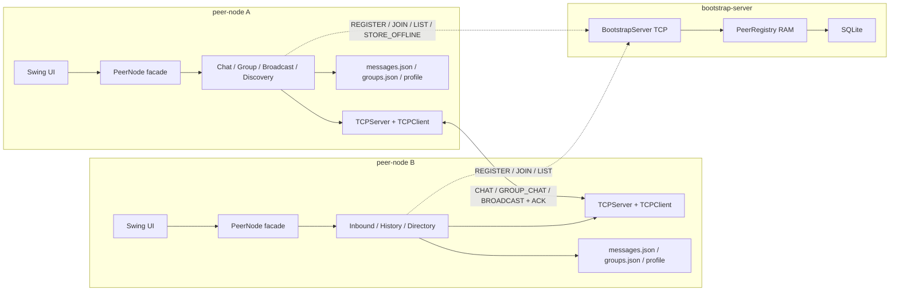
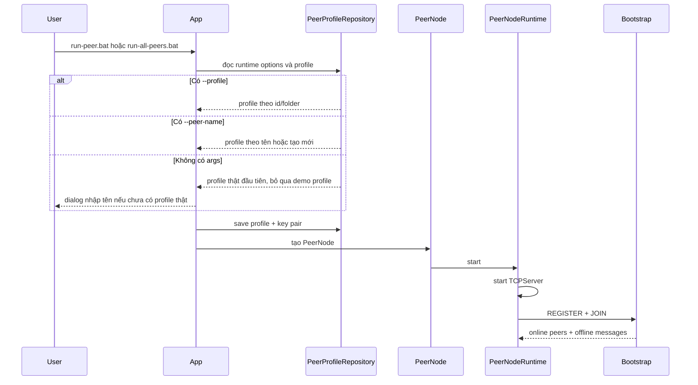

# Tài Liệu Thiết Kế Hệ Thống P2P Chat

Tài liệu này mô tả thiết kế hiện tại của project **P2P Chat System**. Đây là bản thiết kế chốt theo source code, không phải bản đề xuất ban đầu.

## 1. Mục Tiêu Thiết Kế

Hệ thống cần cho phép nhiều peer chat với nhau theo mô hình ngang hàng:

- Mỗi peer vừa gửi tin, vừa mở TCP server để nhận tin.
- Tin online đi trực tiếp giữa peer với peer, không relay qua server trung tâm.
- Bootstrap server chỉ hỗ trợ discovery, trạng thái online/offline, metadata group và offline message.
- Hệ thống có ACK, retry, timeout để xử lý lỗi gửi tin.
- Dữ liệu local của peer được lưu theo profile để giữ lịch sử và định danh qua nhiều lần chạy.

## 2. Phạm Vi Yêu Cầu

| Yêu cầu | Thiết kế đáp ứng |
| --- | --- |
| Tham gia mạng P2P | Peer `REGISTER` và `JOIN` với bootstrap để công bố `peer.id`, tên, IP, port và public key. |
| Chat trực tiếp | Peer gửi `CHAT` trực tiếp qua TCP tới IP:port của peer đích. |
| Chat nhóm | Sender gửi `GROUP_CHAT` trực tiếp tới từng member trong group. |
| Peer discovery | Bootstrap trả danh sách peer online; fallback bằng `PEER_LIST_REQUEST` qua peer đã biết. |
| Online/offline | Bootstrap giữ registry online có TTL; peer refresh bằng `JOIN` định kỳ. |
| Truyền tin đáng tin cậy | Message có UUID; receiver trả `ACK` cùng id; sender retry và timeout. |
| Broadcast toàn mạng | Conversation `[Thế giới]` gửi `BROADCAST` tới các peer online. |
| Store-and-forward | Direct/group message thất bại được lưu offline trên bootstrap nếu có thể. |
| Mã hóa | Payload chat được mã hóa bằng RSA-OAEP SHA-256 theo public key của receiver. |

## 3. Kiến Trúc Tổng Quan



Nguyên tắc chính: bootstrap không xử lý nội dung chat online. Bootstrap chỉ cung cấp dữ liệu để các peer tự kết nối trực tiếp.

## 4. Module Và Trách Nhiệm

### 4.1. `peer-node`

| Thành phần | Trách nhiệm |
| --- | --- |
| `App` | Parse CLI, chọn/tạo profile, khởi động `PeerNode`, mở Swing UI. |
| `PeerNode` | Facade cho UI gọi chat, group, broadcast, discovery và lifecycle. |
| `PeerNodeFactory` | Lắp ráp service, repository, network client/server, gateway và encryption. |
| `PeerNodeRuntime` | Start/stop TCP server và vòng bootstrap sync. |
| `TCPServer`, `ConnectionHandler` | Nhận nhiều kết nối TCP đến và route message. |
| `TCPClient`, `MessageSender` | Gửi message, timeout, retry và kiểm tra ACK. |
| `ChatImpl` | Gửi direct chat, lưu history, store offline nếu gửi thất bại. |
| `GroupChatImpl` | Tạo group, sync member, gửi group message tới từng member. |
| `NetworkBroadcastImpl` | Gửi broadcast `[Thế giới]` tới peer online. |
| `InboundMessageImpl` | Giải mã inbound message, lưu đúng conversation và notify UI. |
| `BootstrapSyncImpl` | Register/join/refresh, nhận offline message, sync group. |
| `RsaMessageEncryptionService` | Mã hóa/giải mã payload chat. |
| `LocalMessageRepo`, `LocalGroupRepo` | Lưu JSON local theo profile. |
| `PeerProfileRepository` | Quản lý profile, key pair và thư mục runtime. |

### 4.2. `bootstrap-server`

| Thành phần | Trách nhiệm |
| --- | --- |
| `BootstrapServer` | TCP server nhận command text một dòng. |
| `PeerRegistry` | Quản lý peer online trong RAM, TTL, offline drain và group lookup. |
| `UserRepo` | Lưu user/peer và public key. |
| `GroupRepo`, `GroupMemberRepo` | Lưu group metadata và danh sách member. |
| `OfflineMessageRepo` | Lưu encrypted offline message và đánh dấu delivered. |
| `Conn`, `Init`, `Config` | Cấu hình SQLite và khởi tạo schema. |

## 5. Mô Hình Dữ Liệu Chính

| Model | Vai trò |
| --- | --- |
| `PeerInfo` | Đại diện một peer: `id`, `name`, `host`, `port`, `online`, `publicKey`. |
| `Message` | Gói tin P2P: type, sender, receiver, group, content, encryption metadata, status. |
| `Group` | Group local gồm `groupId`, `name`, danh sách member theo `PeerInfo`. |
| `OfflineMessage` | DTO lưu tin chờ giao trên bootstrap theo `receiverId`. |
| `PeerProfile` | Cấu hình định danh local: `peer.id`, name, port, key pair, bootstrap host/port. |

Tách biệt quan trọng:

```text
peer.id    -> định danh ổn định của profile/user
host:port  -> địa chỉ runtime để mở TCP socket
publicKey  -> khóa công khai để mã hóa payload
```

## 6. Luồng Khởi Động Peer



## 7. Luồng Gửi Tin

### 7.1. Direct Chat

1. UI gọi `PeerNode.sendMessage(content, target)`.
2. `ChatImpl` resolve target thành `PeerInfo`.
3. `RsaMessageEncryptionService` mã hóa content bằng public key của receiver.
4. `MessageSender` gửi `CHAT` qua TCP và chờ ACK.
5. Receiver giải mã, lưu history và trả `ACK` cùng `message.id`.
6. Sender lưu `SENT` nếu có ACK, `PENDING` nếu store offline được, `FAILED` nếu thất bại hoàn toàn.

### 7.2. Group Chat

1. Group lưu member theo `peer.id`.
2. Khi gửi, `GroupChatImpl` resolve từng member sang `PeerInfo` mới nhất.
3. Với mỗi member, tạo một `GROUP_CHAT` riêng và mã hóa bằng public key của member đó.
4. Member online nhận trực tiếp qua TCP.
5. Member offline được store offline theo `receiverId` nếu bootstrap còn hoạt động.

### 7.3. Broadcast `[Thế giới]`

1. `NetworkBroadcastImpl` lấy danh sách target từ bootstrap `LIST` và `PeerDirectory`.
2. Loại local peer, peer offline, peer thiếu host/port.
3. Gửi `BROADCAST` trực tiếp tới từng peer online.
4. History broadcast lưu riêng bằng conversation key `__broadcast__`.
5. Không store offline cho broadcast.

## 8. Giao Thức

### 8.1. Peer-To-Peer Protocol

Mỗi request là một dòng JSON `Message`, response là một dòng JSON `Message`:

```text
<Message JSON>\n
<Response Message JSON>\n
```

| Type | Ý nghĩa |
| --- | --- |
| `CHAT` | Tin nhắn 1-1. |
| `GROUP_CHAT` | Tin nhắn nhóm gửi tới một member. |
| `BROADCAST` | Tin realtime toàn mạng. |
| `PEER_LIST_REQUEST`, `PEER_LIST_RESPONSE` | Fallback discovery. |
| `GROUP_MEMBERS_SYNC` | Đồng bộ snapshot member nhóm. |
| `HEARTBEAT`, `JOIN`, `LEAVE` | Control message trực tiếp. |
| `ACK` | Xác nhận đã xử lý message. |

ACK hợp lệ khi:

```text
response.type == ACK
response.id == request.id
```

### 8.2. Bootstrap Protocol

Peer gửi command text một dòng:

```text
COMMAND [JSON_PAYLOAD]
```

| Command | Vai trò |
| --- | --- |
| `REGISTER` | Lưu/cập nhật user và public key. |
| `JOIN` | Đánh dấu online, trả online peers và offline messages. |
| `LEAVE` | Xóa peer khỏi online registry. |
| `LIST` | Trả danh sách peer online. |
| `STORE_OFFLINE` | Lưu tin offline cho receiver. |
| `CREATE_GROUP`, `ADD_GROUP_MEMBER`, `LIST_GROUPS`, `LIST_GROUP_MEMBERS` | Quản lý metadata nhóm. |

## 9. Mã Hóa

Mỗi peer profile có RSA key pair. Public key được đưa vào `PeerInfo` và gửi lên bootstrap; private key chỉ lưu local.

| Thành phần | Giá trị |
| --- | --- |
| Key algorithm | RSA |
| Key size | 2048 bit |
| Cipher | `RSA/ECB/OAEPWithSHA-256AndMGF1Padding` |
| Message label | `RSA-OAEP-SHA256` |

Luồng mã hóa:

1. Sender lấy public key của receiver từ discovery.
2. Sender mã hóa `message.content`.
3. Message outbound đặt `encrypted=true`, `encryptionAlgorithm`, `encryptedFor`.
4. Receiver dùng private key local để giải mã trước khi lưu history.
5. Offline message trên bootstrap vẫn là ciphertext; bootstrap không cần biết plaintext.

Nếu receiver thiếu public key hoặc key không hợp lệ, hệ thống không gửi plaintext. Message/target được coi là thất bại.

## 10. Lưu Trữ Và Cấu Hình

Dữ liệu runtime không nằm trong `src/main/resources`. Mặc định:

```text
runtime-data/
├── peer-node/
│   ├── config.properties
│   └── <profile-id>/
│       ├── config.properties
│       ├── messages.json
│       └── groups.json
└── bootstrap-server/
    └── bootstrap-server.db
```

| File | Nội dung |
| --- | --- |
| `runtime-data/peer-node/config.properties` | Bootstrap host/port dùng chung. |
| `<profile>/config.properties` | Peer id, name, port, public key, private key. |
| `<profile>/messages.json` | Direct, group, broadcast history và status. |
| `<profile>/groups.json` | Group local cache. |
| `bootstrap-server.db` | Users, groups, group members, offline messages. |

`runtime-data/` nằm trong `.gitignore` vì chứa history chat, private key và database runtime.

## 11. Đồng Thời Và Vòng Đời

| Thành phần | Thiết kế |
| --- | --- |
| UI | Swing Event Dispatch Thread. |
| Peer TCP listener | Một thread `PeerNode-TCPServer-<port>`. |
| Kết nối TCP đến | Cached thread pool trong `TCPServer`. |
| Bootstrap sync | Thread nền `PeerNode-Bootstrap`, refresh mỗi 5 giây. |
| Bootstrap server | Cached thread pool xử lý nhiều command. |
| Local JSON repo | Các method đọc/ghi chính được synchronized. |
| Group sync trực tiếp | `CompletableFuture.runAsync` để không khóa UI. |

Peer shutdown:

1. Gửi `LEAVE` lên bootstrap nếu có gateway.
2. Dừng TCP server.
3. Shutdown executor.
4. UI đóng sau khi `PeerNode.stop()` được gọi.

## 12. Xử Lý Lỗi

| Lỗi | Cách xử lý |
| --- | --- |
| Peer đích offline | Timeout, retry, sau đó store offline nếu có bootstrap. |
| ACK sai hoặc thiếu | Retry; sau retry hết thì fallback offline/failed. |
| Bootstrap tắt | Peer vẫn mở TCP server và có thể chat với peer đã biết, nhưng mất discovery/offline store mới. |
| Peer tắt đột ngột | Bootstrap loại khỏi online registry sau TTL. |
| Group local có nhưng bootstrap rỗng | Giữ group local và publish lại lên bootstrap. |
| File JSON rỗng/lỗi record | Repository đọc thành danh sách rỗng hoặc bỏ record lỗi, không làm crash app. |
| Không mã hóa được | Không gửi plaintext; đánh dấu thất bại. |

## 13. Quyết Định Thiết Kế

| Quyết định | Lý do |
| --- | --- |
| Bootstrap không relay chat online | Giữ đúng mô hình P2P, giảm phụ thuộc server trung tâm. |
| Group gửi tới từng member | Đơn giản, rõ ACK theo từng receiver, phù hợp quy mô demo. |
| Broadcast không store offline | Broadcast là realtime toàn mạng; peer offline bỏ lỡ là hành vi có chủ ý. |
| Dùng `peer.id` ổn định, IP:port runtime | Định danh không đổi, địa chỉ mạng có thể đổi qua từng lần chạy. |
| Tách runtime data khỏi resources | Tránh đóng gói/commit history, private key và database phát sinh khi chạy. |
| Interface gateway nhỏ | Service chỉ phụ thuộc phần bootstrap mình cần, dễ test và đúng ISP. |

## 14. Giới Hạn Hiện Tại

- Chưa hỗ trợ NAT traversal; các peer cần kết nối trực tiếp được IP:port của nhau.
- Bootstrap vẫn là điểm phụ thuộc cho discovery tự động và store-and-forward.
- Bootstrap chưa có replication/clustering.
- Broadcast không có offline delivery.
- Offline message được đánh dấu delivered khi receiver `JOIN`, chưa có delivered/read receipt đầy đủ từ UI.
