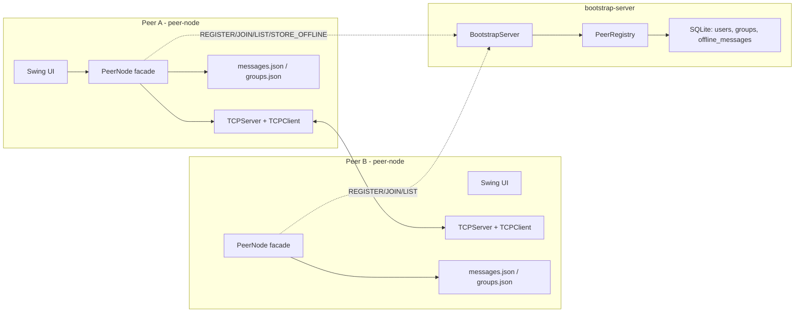
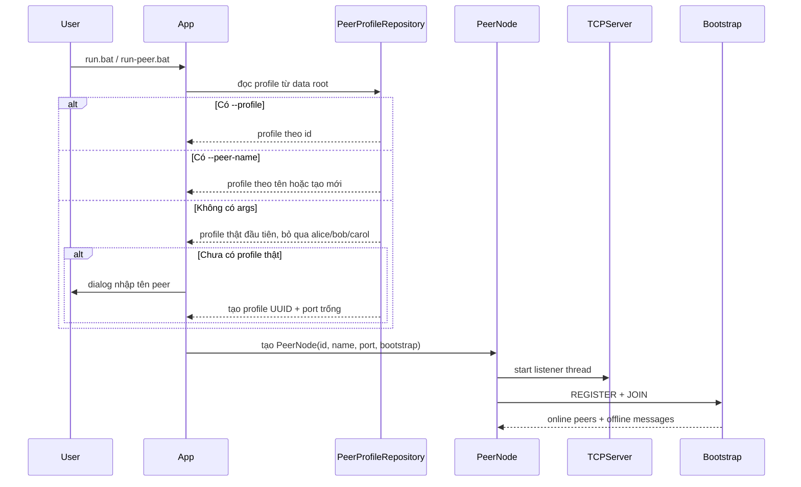

# Thiết kế hệ thống P2P Chat

Hệ thống là ứng dụng chat ngang hàng bằng Java Swing + TCP socket. Bootstrap server chỉ giữ vai trò tracker hỗ trợ khám phá peer, trạng thái online/offline, metadata nhóm và store-and-forward khi gửi trực tiếp thất bại.

## 1. Phạm vi yêu cầu

| Nhóm yêu cầu | Cách hệ thống đáp ứng |
| --- | --- |
| Tham gia mạng P2P | Peer đăng ký `REGISTER` và `JOIN` với bootstrap để công bố `peer.id`, tên, IP và port lắng nghe. |
| Chat trực tiếp | Peer gửi `CHAT` trực tiếp qua TCP tới IP:port của peer đích, không đi qua bootstrap khi peer online. |
| Chat nhóm | Group lưu danh sách member theo `peer.id`; khi gửi, peer resolve member sang địa chỉ runtime rồi gửi `GROUP_CHAT` tới từng member. |
| Peer discovery | Bootstrap trả danh sách peer online; khi bootstrap không khả dụng có fallback hỏi peer đã biết bằng `PEER_LIST_REQUEST`. |
| Online/offline | Bootstrap giữ cache peer online với TTL; peer refresh định kỳ bằng `JOIN`. UI hiển thị trạng thái từ danh bạ runtime. |
| Truyền tin đáng tin cậy | Mỗi message có UUID, receiver trả `ACK` cùng id; sender retry tối đa 3 lần và timeout socket. |
| Broadcast toàn mạng | UI có conversation riêng `[Thế giới]`; gửi `BROADCAST` tới các peer online hiện biết. Offline peer không nhận lại broadcast. |
| Store-and-forward | Chat 1-1 và group message có thể lưu offline trên bootstrap khi gửi trực tiếp thất bại. |

## 2. Kiến trúc tổng quan



Quy tắc quan trọng: bootstrap không relay tin chat online. Tin 1-1, group và broadcast đều đi từ peer gửi tới peer nhận bằng TCP socket. Bootstrap chỉ cung cấp thông tin địa chỉ và lưu tin offline cho chat 1-1/group khi không giao trực tiếp được.

## 3. Thành phần chính

### 3.1. peer-node

| Package / lớp | Vai trò |
| --- | --- |
| `dungcony.ds.App` | Entry point desktop: parse CLI, chọn/tạo profile, khởi động `PeerNode`, mở Swing UI. |
| `dungcony.ds.app.PeerNode` | Facade cho UI gọi các thao tác chat, group, discovery, broadcast và retry. |
| `PeerNodeFactory` | Lắp ráp dependency graph cho một peer. |
| `PeerNodeRuntime` | Quản lý vòng đời TCP server và vòng refresh bootstrap. |
| `network.TCPServer` | Lắng nghe TCP trên port của peer, nhận nhiều kết nối bằng cached thread pool. |
| `network.TCPClient` | Mở socket tới peer đích, gửi một dòng JSON, đọc ACK/response. |
| `network.MessageSender` | Bọc `TCPClient` với retry, delay và kiểm tra ACK. |
| `services.impl.chat.ChatImpl` | Gửi chat 1-1, lưu history, store offline nếu cần. |
| `services.impl.group.GroupChatImpl` | Tạo nhóm, thêm member, đổi tên nhóm, gửi group chat, sync membership. |
| `services.impl.messaging.NetworkBroadcastImpl` | Gửi broadcast tới các peer online và lưu history `[Thế giới]`. |
| `services.impl.bootstrap.BootstrapSyncImpl` | `REGISTER/JOIN`, refresh peer online, sync group và nhận offline message. |
| `repositories.LocalMessageRepo` | Lưu `messages.json`, tách direct/group/broadcast history. |
| `repositories.PeerProfileRepository` | Đọc/ghi profile trên filesystem; không nằm trong `config` để giữ đúng trách nhiệm repository. |

### 3.2. bootstrap-server

| Package / lớp | Vai trò |
| --- | --- |
| `models.BootstrapServer` | Tracker TCP độc lập, nhận command một dòng text. |
| `models.PeerRegistry` | Cache peer online trong RAM, TTL 15 giây, điều phối user/group/offline repo. |
| `repositories.UserRepo` | Lưu user đã đăng ký. |
| `repositories.GroupRepo`, `GroupMemberRepo` | Lưu metadata nhóm và member theo `userId`. |
| `repositories.OfflineMessageRepo` | Lưu và drain tin offline khi receiver join lại. |

## 4. Luồng khởi động peer



Luồng người dùng thường không cần nhập gì ở terminal. Nếu đã có profile thật thì app vào thẳng màn chat. Nếu chỉ có profile demo `alice`, `bob`, `carol` hoặc chưa có profile, app mở dialog nhập tên peer; `peer.id` và port được tự sinh/tự chọn.

## 5. Luồng runtime và thread

Một tiến trình peer có các luồng chính:

| Luồng | Nguồn | Vai trò |
| --- | --- | --- |
| Swing Event Dispatch Thread | Swing | Render UI và xử lý event người dùng. |
| `PeerNode-TCPServer-<port>` | `PeerNodeRuntime` | Lắng nghe TCP đến. |
| Connection pool | `TCPServer` | Xử lý nhiều socket đến cùng lúc bằng `ConnectionHandler`. |
| `PeerNode-Bootstrap` | `PeerNodeRuntime` | `REGISTER/JOIN` ban đầu, sau đó refresh bootstrap mỗi 5 giây. |
| CompletableFuture background | `GroupChatImpl` | Sync membership nhóm mà không khóa UI. |

Không tách thành bốn thread cố định cho gửi tin, heartbeat và lấy tin offline. Gửi tin chạy theo thao tác UI/background hiện tại; offline message được lấy trong response `JOIN` của vòng bootstrap sync.

## 6. Luồng gửi tin

### 6.1. Chat 1-1

1. UI chọn peer trực tiếp và gọi `PeerNode.sendMessage(content, addressKey)`.
2. `ChatImpl` resolve `host:port` sang `PeerInfo`.
3. `MessageSender` gửi `CHAT` qua `TCPClient`.
4. Receiver route message, lưu history, trả `ACK` cùng `message.id`.
5. Sender nhận ACK hợp lệ thì lưu local status `SENT`.
6. Nếu timeout/không ACK sau retry, sender gọi `STORE_OFFLINE` lên bootstrap. Lưu được thì status `PENDING`, không lưu được thì `FAILED`.

### 6.2. Chat nhóm

1. Group chứa member theo `peer.id`.
2. Khi gửi, `GroupChatImpl` lấy địa chỉ mới nhất của từng member từ `PeerDirectory`.
3. Với từng member online, gửi `GROUP_CHAT` trực tiếp bằng TCP.
4. Member offline được lưu fallback qua bootstrap theo `receiverId`.
5. Local history nhóm lưu dưới conversation ảo `group:<groupId>`.

### 6.3. Broadcast toàn mạng

Broadcast được thể hiện như một cuộc chat riêng `[Thế giới]` trong danh sách chat. Người dùng chọn `[Thế giới]` rồi gửi như chat thường.

1. `SendMessageBox` phát hiện `ChatScreen` đang ở chế độ broadcast.
2. `PeerNode.broadcastToNetwork(content)` lấy peer online từ bootstrap và danh bạ runtime.
3. Gửi `BROADCAST` tới từng peer online bằng TCP + ACK.
4. Message của người gửi và người nhận đều lưu vào history riêng `__broadcast__`.
5. Broadcast là kiểu "ai online thì nhận"; không store offline.

## 7. Giao thức

### 7.1. Peer-to-peer protocol

Mỗi kết nối TCP giữa peer gửi đúng một dòng JSON biểu diễn `Message`, receiver trả một dòng JSON response.

Các type chính:

| Type | Ý nghĩa |
| --- | --- |
| `CHAT` | Tin nhắn 1-1. |
| `GROUP_CHAT` | Tin nhắn nhóm gửi tới một member cụ thể. |
| `BROADCAST` | Tin `[Thế giới]` gửi tới peer online. |
| `PEER_LIST_REQUEST` / `PEER_LIST_RESPONSE` | Discovery fallback qua peer đã biết. |
| `GROUP_MEMBERS_SYNC` | Đồng bộ snapshot member nhóm. |
| `HEARTBEAT`, `JOIN`, `LEAVE` | Control message trực tiếp. |
| `ACK` | Xác nhận đã xử lý message. |

ACK hợp lệ khi `response.type == ACK` và `response.id == message.id`.

### 7.2. Bootstrap protocol

Peer gửi command text một dòng:

```text
COMMAND [JSON_PAYLOAD]
```

Các command hiện dùng:

| Command | Vai trò |
| --- | --- |
| `REGISTER` | Lưu user/profile vào SQLite. |
| `JOIN` | Đánh dấu peer online, trả online peers và offline messages. |
| `LEAVE` | Xóa peer khỏi online registry. |
| `LIST` | Trả danh sách peer online. |
| `STORE_OFFLINE` | Lưu tin offline cho receiver. |
| `CREATE_GROUP`, `ADD_GROUP_MEMBER`, `LIST_GROUPS`, `LIST_GROUP_MEMBERS` | Quản lý metadata nhóm. |

## 8. Lưu trữ

Mặc định dữ liệu peer nằm trong:

```text
peer-node/src/main/resources/data/
```

Mỗi profile có folder riêng:

```text
data/
├── config.properties          # bootstrap.host, bootstrap.port dùng chung
├── alice/                     # profile demo
│   ├── config.properties
│   ├── messages.json
│   └── groups.json
└── <uuid-profile>/
    ├── config.properties      # peer.id, peer.name, peer.port
    ├── messages.json
    └── groups.json
```

`messages.json` lưu cả direct, group và broadcast, nhưng khi đọc UI sẽ tách:

| Conversation | Khóa lưu |
| --- | --- |
| Direct chat | `conversationPeerId = peer.id` |
| Group chat | `conversationPeerId = groupId`, `conversationPeerKey = group:<groupId>` |
| Broadcast | `conversationPeerId = __broadcast__`, `conversationPeerKey = broadcast:world:0` |

Bootstrap lưu SQLite cho user, group, group member và offline message.

## 9. Giới hạn thiết kế

- Bootstrap vẫn là điểm phụ thuộc cho discovery tự động và store-and-forward.
- Broadcast không có offline delivery để giữ đúng mô hình "chat thế giới" realtime.
- Chưa có NAT traversal; peer phải kết nối được tới IP:port của nhau.
- Chưa mã hóa payload TCP.
- Offline delivery được đánh dấu delivered khi receiver `JOIN`; chưa có ACK ngược về bootstrap sau khi UI hiển thị.
