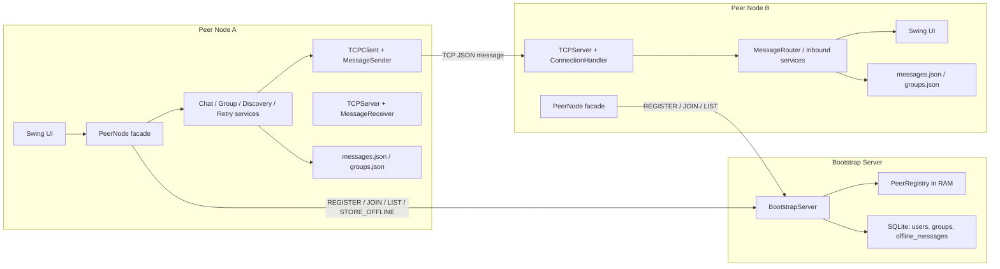
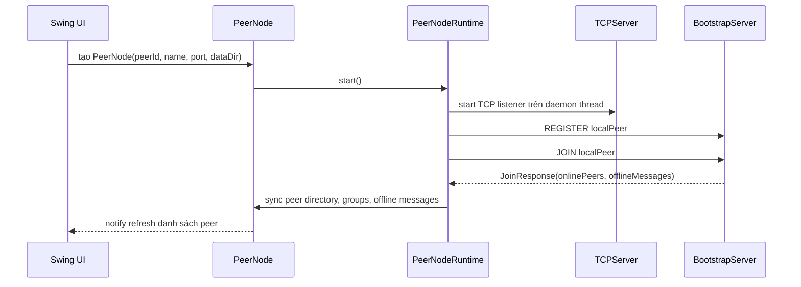
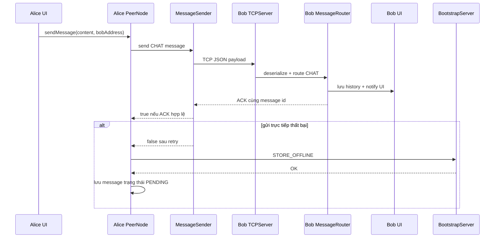

# Báo cáo kiến trúc hệ thống

## 1. Thông tin chung

| Mục | Nội dung |
| --- | --- |
| Tên hệ thống | P2P Chat System |
| Mục tiêu | Xây dựng ứng dụng chat ngang hàng cho phép nhiều peer gửi/nhận tin nhắn trực tiếp qua TCP Socket. |
| Công nghệ | Java 21, Swing, Maven, TCP Socket, Gson, SQLite |
| Kiểu kiến trúc | Peer-to-peer có bootstrap/tracker hỗ trợ |
| Module chính | `peer-node`, `bootstrap-server` |

## 2. Mục tiêu thiết kế

Hệ thống được thiết kế để thể hiện các đặc trưng cơ bản của hệ phân tán:

- Mỗi peer là một tiến trình độc lập, có thể vừa gửi vừa nhận tin.
- Giao tiếp giữa các peer diễn ra trực tiếp qua TCP Socket.
- Bootstrap server chỉ hỗ trợ khám phá peer, trạng thái online/offline, group metadata và offline message; không đóng vai trò server chat trung tâm.
- Hệ thống xử lý nhiều kết nối đồng thời bằng thread pool.
- Tin nhắn có cơ chế ACK, retry, timeout và fallback store-and-forward.

## 3. Kiến trúc tổng quan



Trong mô hình này, `bootstrap-server` không đọc và chuyển tiếp mọi tin nhắn chat online. Khi peer A gửi tin cho peer B, payload chat đi trực tiếp từ socket của A tới socket của B. Bootstrap chỉ tham gia khi peer cần danh sách online, đồng bộ group hoặc lưu tin offline.

## 4. Phân rã module

### 4.1. Module `peer-node`

`peer-node` là ứng dụng desktop Swing đại diện cho một peer. Mỗi instance có `peerId`, `peerName`, `host`, `port` và thư mục dữ liệu riêng.

| Package / lớp | Vai trò |
| --- | --- |
| `dungcony.ds.App` | Entry point của peer application. |
| `dungcony.ds.app.PeerNode` | Facade công khai cho UI gọi các thao tác chat, group, discovery, retry. |
| `dungcony.ds.app.PeerNodeFactory` | Lắp ráp dependency graph cho một peer. |
| `dungcony.ds.app.PeerNodeRuntime` | Quản lý vòng đời TCP server và vòng refresh bootstrap. |
| `dungcony.ds.network.TCPServer` | Mở `ServerSocket`, accept nhiều kết nối đến. |
| `dungcony.ds.network.ConnectionHandler` | Xử lý một kết nối TCP đến, đọc một dòng JSON và trả response. |
| `dungcony.ds.network.TCPClient` | Kết nối tới peer khác, gửi message, chờ ACK/response. |
| `dungcony.ds.network.MessageSender` | Bọc TCPClient với retry và kiểm tra ACK. |
| `dungcony.ds.network.BootstrapClient` | Gửi command tới bootstrap server. |
| `dungcony.ds.services.impl.chat.ChatImpl` | Gửi chat 1-1, lưu history, fallback offline. |
| `dungcony.ds.services.impl.group.GroupChatImpl` | Tạo nhóm, gửi group chat, sync membership. |
| `dungcony.ds.services.impl.peer.PeerDiscoverImpl` | Discovery fallback bằng `PEER_LIST_REQUEST`. |
| `dungcony.ds.services.impl.messaging.MessageRouterImpl` | Phân loại message đến theo `MessageType`. |
| `dungcony.ds.repositories.LocalMessageRepo` | Lưu lịch sử tin nhắn local bằng JSON. |
| `dungcony.ds.repositories.LocalGroupRepo` | Lưu danh sách group local bằng JSON. |

### 4.2. Module `bootstrap-server`

`bootstrap-server` là tracker độc lập, chạy trên một port TCP cố định, mặc định `9000`.

| Package / lớp | Vai trò |
| --- | --- |
| `dungcony.ds.App` | Entry point chạy bootstrap server. |
| `dungcony.ds.models.BootstrapServer` | Lắng nghe TCP command, phân loại và xử lý request. |
| `dungcony.ds.models.PeerRegistry` | Quản lý peer online trong RAM, TTL, offline message, group metadata. |
| `dungcony.ds.config.Conn` | Kết nối SQLite. |
| `dungcony.ds.config.Init` | Khởi tạo schema database. |
| `dungcony.ds.repositories.UserRepo` | Lưu/cập nhật user. |
| `dungcony.ds.repositories.GroupRepo` | Lưu/cập nhật group. |
| `dungcony.ds.repositories.GroupMemberRepo` | Lưu thành viên group. |
| `dungcony.ds.repositories.OfflineMessageRepo` | Lưu và drain offline message. |

## 5. Luồng khởi động peer



Sau khi start, peer có hai vòng hoạt động song song:

- `TCPServer.listen()` nhận message từ peer khác.
- `runBootstrapSyncLoop()` định kỳ `JOIN` lại bootstrap để refresh danh sách online, group và offline message.

## 6. Luồng gửi tin nhắn 1-1



Trạng thái message phía sender:

| Trạng thái | Ý nghĩa |
| --- | --- |
| `SENT` | Đã nhận ACK hợp lệ từ peer đích. |
| `PENDING` | Gửi trực tiếp thất bại nhưng đã lưu offline message lên bootstrap. |
| `FAILED` | Gửi trực tiếp thất bại và không lưu được fallback. |
| `SENDING` | Đang retry thủ công một message cũ. |

## 7. Luồng chat nhóm

Group chat không dùng server trung tâm để fan-out. Peer gửi tự lặp qua từng thành viên:

1. UI gọi `PeerNode.sendGroupMessage(groupId, content)`.
2. `GroupChatImpl` lấy group từ `GroupManager`.
3. Với mỗi member khác local peer:
   - Resolve địa chỉ member mới nhất từ `PeerDirectoryService`.
   - Nếu member online, gửi `GROUP_CHAT` qua TCP trực tiếp.
   - Nếu gửi thất bại, lưu offline message qua bootstrap theo `receiverId`.
4. Lưu một bản message tổng vào history group local.
5. Notify UI cập nhật màn hình chat.

Group metadata được đồng bộ bằng hai đường:

- Bootstrap: `CREATE_GROUP`, `ADD_GROUP_MEMBER`, `LIST_GROUPS`, `LIST_GROUP_MEMBERS`.
- Peer-to-peer: `GROUP_MEMBERS_SYNC` gửi snapshot membership trực tiếp tới các member reachable.

## 8. Luồng broadcast toàn mạng

Broadcast toàn mạng được xử lý bởi `NetworkBroadcastImpl`:

1. Lấy danh sách peer online từ bootstrap bằng `LIST`.
2. Merge với danh bạ peer runtime.
3. Loại bỏ local peer, peer offline, peer thiếu host/port.
4. Gửi message `BROADCAST` tới từng peer bằng TCP trực tiếp.
5. Trả về `BroadcastResult(totalTargets, delivered, failed)`.

## 9. Lưu trữ dữ liệu

### 9.1. Lưu trữ tại peer

Mỗi profile peer có thư mục dữ liệu riêng:

```text
<data-dir>/
  config.properties
  messages.json
  groups.json
```

| File | Nội dung |
| --- | --- |
| `config.properties` | Thông tin định danh profile như `peer.id`, `peer.name`, `peer.port`. |
| `messages.json` | Lịch sử message theo conversation, bao gồm message id, type, content, timestamp, status. |
| `groups.json` | Group mà peer tham gia và danh sách member đã biết. |

Repository JSON dùng `synchronized` để tránh ghi/đọc đồng thời gây hỏng file trong cùng một process.

### 9.2. Lưu trữ tại bootstrap

Bootstrap server dùng SQLite:

| Bảng logic | Nội dung |
| --- | --- |
| Users | User/peer đã đăng ký. |
| Groups | Metadata group. |
| Group Members | Quan hệ group - user. |
| Offline Messages | Tin nhắn chờ giao khi receiver offline. |

Danh sách peer online không lưu DB. Nó nằm trong `ConcurrentHashMap` của `PeerRegistry` và được cập nhật bằng `JOIN`/`LEAVE`.

## 10. Đồng thời và phân tán

| Vấn đề | Cách triển khai |
| --- | --- |
| Peer vừa gửi vừa nhận | Mỗi peer chạy `TCPServer` nền và dùng `TCPClient` khi gửi. |
| Nhiều kết nối đến | `TCPServer` và `BootstrapServer` dùng `Executors.newCachedThreadPool()`. |
| Danh bạ peer runtime | `PeerDirectoryImpl` dùng `ConcurrentHashMap`. |
| Listener UI | `PeerNode` dùng `CopyOnWriteArrayList` cho listener. |
| Cập nhật UI Swing | Event được dispatch qua `SwingEventDispatcher`. |
| Dữ liệu local JSON | Repository local đồng bộ bằng `synchronized`. |

## 11. Quyết định thiết kế chính

### 11.1. Bootstrap chỉ là tracker, không phải chat relay

Hệ thống giữ tính P2P bằng cách gửi chat online trực tiếp giữa peer. Bootstrap không phải điểm trung chuyển chính, nhờ đó nếu bootstrap tạm mất, peer vẫn có thể gửi trực tiếp tới địa chỉ đã biết.

### 11.2. Mỗi message có `id` ổn định

`id` được dùng để kiểm tra ACK và tránh nhân đôi khi cập nhật trạng thái message trong local history.

### 11.3. Store-and-forward cho trường hợp offline

Khi gửi trực tiếp thất bại, sender cố gắng lưu message lên bootstrap. Receiver nhận lại các tin này trong lần `JOIN` tiếp theo.

### 11.4. Tách service theo trách nhiệm

`PeerNode` chỉ là facade; logic được tách thành các service như `ChatImpl`, `GroupChatImpl`, `PeerDiscoverImpl`, `MessageRetryImpl`. Cách này giúp UI không phụ thuộc trực tiếp vào socket hoặc persistence.

## 12. Hạn chế hiện tại

- Chưa triển khai mã hóa đầu cuối cho nội dung tin nhắn.
- Chưa có xác thực mạnh cho peer hoặc bootstrap command.
- Chưa hỗ trợ NAT traversal; peer cần reachable qua host/port.
- Bootstrap server là một điểm phụ thuộc cho discovery tự động và offline message.
- Offline message được đánh dấu delivered khi receiver `JOIN`; chưa có xác nhận delivery cuối cùng từ UI receiver về bootstrap.

## 13. Hướng phát triển

- Bổ sung mã hóa end-to-end cho payload chat.
- Thêm chữ ký hoặc token để xác thực peer.
- Hỗ trợ nhiều bootstrap server hoặc cơ chế tracker dự phòng.
- Thêm cơ chế delivery receipt nhiều trạng thái: sent, delivered, read.
- Tối ưu lưu trữ local bằng embedded database thay vì JSON khi dữ liệu lớn.
