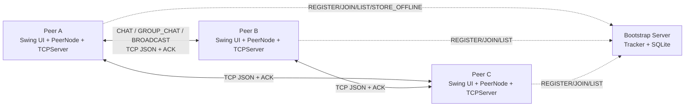
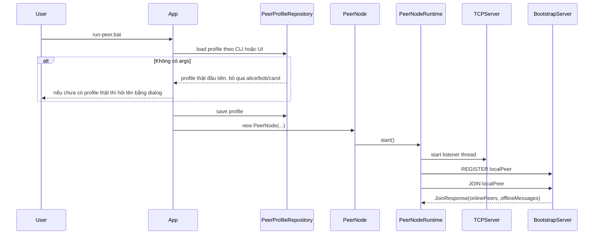
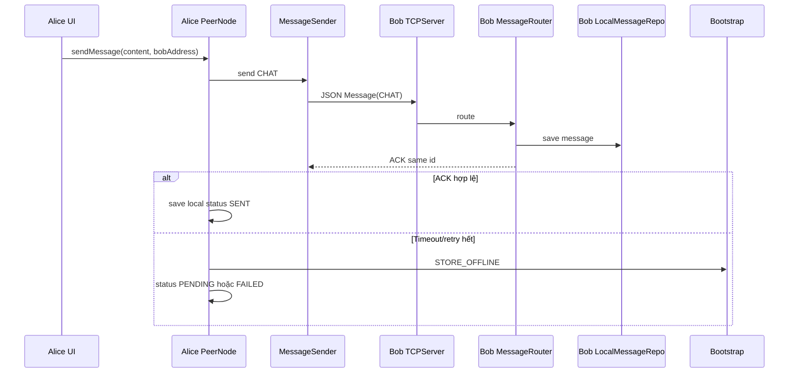
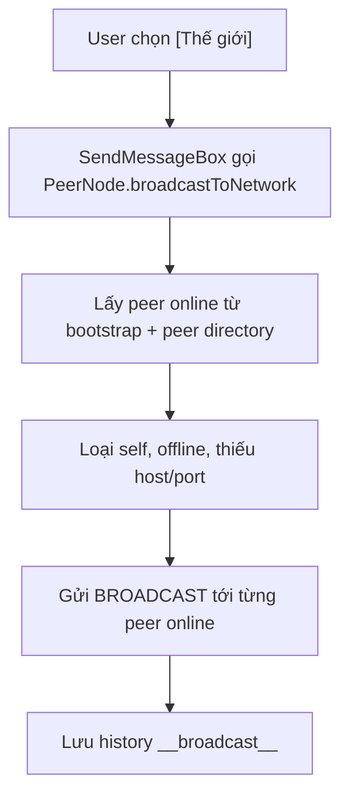

# Báo Cáo Kiến Trúc Hệ Thống

## 1. Tổng Quan

Hệ thống triển khai mô hình **peer-to-peer có bootstrap/tracker hỗ trợ**.
Mỗi peer vừa là client gửi tin, vừa là server TCP nhận tin. Bootstrap server không phải server chat trung tâm; nó chỉ giúp peer tìm nhau, quản lý trạng thái online/offline, lưu metadata nhóm và lưu tin offline khi gửi trực tiếp thất bại.



## 2. Đối Chiếu Yêu Cầu

| Yêu cầu trong `require.md` | Thiết kế / code hiện tại |
| --- | --- |
| Peer có thể tham gia mạng P2P | `App` tạo `PeerNode`, `PeerNodeRuntime` start TCP listener và `BootstrapSyncImpl` `REGISTER/JOIN`. |
| Hệ thống cung cấp danh sách peer online | `BootstrapServer` trả `LIST`/`JOIN`, `PeerDirectoryImpl` sync vào danh bạ runtime. |
| Chat 1-1 trực tiếp | `ChatImpl` gửi `MessageType.CHAT` qua `MessageSender` và `TCPClient`. |
| Chat nhóm | `GroupChatImpl` gửi `GROUP_CHAT` tới từng member. |
| Peer discovery | Bootstrap discovery + fallback `PEER_LIST_REQUEST`. |
| Online/offline | Bootstrap cache peer online với TTL 15 giây; peer refresh mỗi 5 giây. |
| ACK, retry, timeout | `TCPClient` có connect/read timeout; `MessageSender` retry 3 lần; ACK phải trùng message id. |
| Xử lý nhiều kết nối | `TCPServer` và `BootstrapServer` dùng cached thread pool. |
| Store-and-forward | `STORE_OFFLINE`, `OfflineMessageRepo`, drain khi receiver `JOIN`. |
| Broadcast toàn mạng | Conversation `[Thế giới]`, type `BROADCAST`, gửi tới peer online. |

## 3. Module `peer-node`

`peer-node` là ứng dụng desktop Swing và cũng là một node P2P.

### 3.1. Các lớp chính

| Lớp / package | Trách nhiệm |
| --- | --- |
| `dungcony.ds.App` | Entry point, parse runtime option, chọn/tạo profile, mở UI. |
| `dungcony.ds.app.PeerNode` | Facade cho UI; gom các nghiệp vụ chat, group, broadcast, discovery. |
| `PeerNodeFactory` | Tạo và inject các service/repository/network dependency. |
| `PeerNodeRuntime` | Start/stop TCP server và vòng bootstrap sync. |
| `network.TCPServer` | `ServerSocket` lắng nghe port local. |
| `network.ConnectionHandler` | Xử lý một kết nối TCP đến. |
| `network.TCPClient` | Gửi message tới peer khác. |
| `network.MessageSender` | Retry và validate ACK. |
| `services.impl.chat.ChatImpl` | Chat trực tiếp 1-1. |
| `services.impl.group.GroupChatImpl` | Group chat, create group, add member, rename group. |
| `services.impl.messaging.NetworkBroadcastImpl` | Broadcast `[Thế giới]`. |
| `services.impl.messaging.InboundMessageImpl` | Lưu inbound message vào đúng conversation. |
| `services.impl.bootstrap.BootstrapSyncImpl` | Đồng bộ bootstrap, nhận offline message. |
| `repositories.LocalMessageRepo` | Lưu và đọc `messages.json`. |
| `repositories.LocalGroupRepo` | Lưu và đọc `groups.json`. |
| `repositories.PeerProfileRepository` | Đọc/ghi profile peer từ filesystem. |

### 3.2. Facade `PeerNode`

UI không gọi trực tiếp socket hoặc repository. UI gọi `PeerNode`, sau đó `PeerNode` ủy quyền:

```text
UI -> PeerNode -> ChatService / GroupChatService / NetworkBroadcastService
              -> PeerDirectoryService / ConversationService / BootstrapSyncService
              -> MessageSender / repositories
```

Cách này giữ UI tách khỏi network/persistence và giúp test nghiệp vụ dễ hơn.

## 4. Module `bootstrap-server`

`bootstrap-server` là tracker TCP độc lập.

| Lớp / package | Trách nhiệm |
| --- | --- |
| `models.BootstrapServer` | Nhận command TCP một dòng text và dispatch. |
| `models.PeerRegistry` | Cache peer online trong RAM, TTL, offline message, group metadata. |
| `repositories.UserRepo` | Lưu user đã đăng ký. |
| `repositories.GroupRepo` | Lưu group metadata. |
| `repositories.GroupMemberRepo` | Lưu member group theo `userId`. |
| `repositories.OfflineMessageRepo` | Lưu tin offline và đánh dấu delivered. |
| `config.Conn`, `config.Init` | Kết nối SQLite và khởi tạo schema. |

Bootstrap lưu online peer trong RAM để trạng thái online thay đổi nhanh. SQLite dùng cho dữ liệu cần tồn tại qua vòng đời process: user, group, member, offline message.

## 5. Luồng Khởi Động



Điểm chốt: user không phải nhập tên ở terminal. Terminal chỉ dùng để chạy script. Profile thật được dùng lại tự động; profile demo chỉ phục vụ test/demo.

## 6. Luồng Chat Trực Tiếp



Message status:

| Status | Ý nghĩa |
| --- | --- |
| `SENT` | Đã nhận ACK hợp lệ. |
| `PENDING` | Gửi trực tiếp thất bại nhưng bootstrap đã lưu offline. |
| `FAILED` | Gửi trực tiếp thất bại và không store offline được. |

## 7. Luồng Chat Nhóm

Group không gửi qua một server trung tâm. Khi Alice gửi nhóm:

1. `GroupChatImpl` lấy group local.
2. Với từng member, resolve `peer.id` sang IP:port mới nhất trong `PeerDirectory`.
3. Gửi một message `GROUP_CHAT` riêng tới từng member.
4. Member nào không gửi trực tiếp được thì store offline theo `receiverId`.
5. Local history nhóm lưu dưới conversation ảo `group:<groupId>`.

Membership nhóm được đồng bộ bằng hai kênh:

- Bootstrap lưu metadata group và member id.
- Peer gửi `GROUP_MEMBERS_SYNC` trực tiếp để các peer reachable cập nhật nhanh.

## 8. Luồng Broadcast Toàn Mạng

UI hiển thị broadcast như một conversation riêng `[Thế giới]`.



Broadcast là realtime best-effort:

- Peer online nhận qua TCP và trả ACK.
- Peer offline không nhận lại sau này.
- Broadcast không xuất hiện trong chat riêng.
- Local history lưu bằng `BroadcastConversation.ID = "__broadcast__"`.

## 9. Peer Discovery Và Địa Chỉ IP:port

ACK/gửi TCP luôn cần IP:port. Hệ thống không chỉ dựa vào `peer.id` khi gửi:

- `peer.id` là định danh ổn định để nhận diện user/profile.
- `host:port` là địa chỉ runtime để mở socket.
- Bootstrap trả `PeerInfo(id, name, host, port, online)`.
- Group member lưu theo id; khi gửi sẽ resolve id sang `PeerInfo` mới nhất từ danh bạ.

Khi bootstrap không khả dụng, peer vẫn có thể dùng địa chỉ đã biết hoặc hỏi peer đã biết bằng `PEER_LIST_REQUEST`.

## 10. Lưu Trữ

### 10.1. Peer local

| File | Nội dung |
| --- | --- |
| `data/config.properties` | `bootstrap.host`, `bootstrap.port` dùng chung. |
| `data/<profile>/config.properties` | `peer.id`, `peer.name`, `peer.port`. |
| `data/<profile>/messages.json` | Direct, group, broadcast history. |
| `data/<profile>/groups.json` | Group local cache. |

### 10.2. Bootstrap SQLite

| Bảng | Nội dung |
| --- | --- |
| `users` | User/peer đã đăng ký. |
| `groups` | Group metadata. |
| `group_members` | Member group theo `userId`. |
| `offline_messages` | Tin chờ giao khi receiver offline. |

## 11. Xử Lý Đồng Thời

| Nơi phát sinh đồng thời | Cách xử lý |
| --- | --- |
| Nhiều peer kết nối vào một peer | `TCPServer` accept và submit `ConnectionHandler` vào cached thread pool. |
| Nhiều peer gọi bootstrap | `BootstrapServer` dùng cached thread pool. |
| UI listener | `PeerNode` dùng `CopyOnWriteArrayList`. |
| Message history memory | `ConcurrentHashMap` + synchronized list. |
| File JSON local | Repository method `synchronized`. |
| Group membership sync | `CompletableFuture.runAsync`. |

## 12. Quyết Định Thiết Kế

### 12.1. Bootstrap không relay chat online

Điều này giữ đúng tinh thần P2P: chat online đi trực tiếp giữa peer. Bootstrap chỉ hỗ trợ discovery và fallback offline.

### 12.2. Dùng `peer.id` cho định danh, IP:port cho kết nối

`peer.id` ổn định qua các lần chạy, còn IP:port có thể đổi. Vì vậy danh bạ runtime luôn cần `PeerInfo` đầy đủ khi gửi message/ACK.

### 12.3. Broadcast tách khỏi chat riêng

Broadcast `[Thế giới]` là một luồng riêng. Nếu để broadcast rơi vào chat riêng sẽ gây hiểu nhầm giữa tin 1-1 và tin toàn mạng, nên history được tách bằng conversation ảo `__broadcast__`.

### 12.4. Profile người dùng không nhập ở terminal

Terminal chỉ dùng chạy script. App tự quyết định profile:

- Có profile thật thì dùng lại.
- Chưa có thì mở dialog nhập tên.
- Demo profile không được chọn làm profile thật mặc định.

## 13. Hạn Chế

- Chưa có mã hóa payload.
- Chưa hỗ trợ NAT traversal.
- Bootstrap vẫn là điểm phụ thuộc cho discovery tự động và offline message.
- Broadcast không store offline.
- Offline message được drain khi receiver `JOIN`, chưa cần receiver ACK lại bootstrap.
