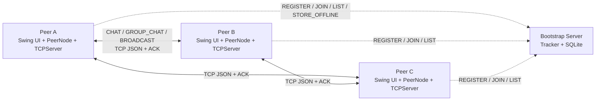
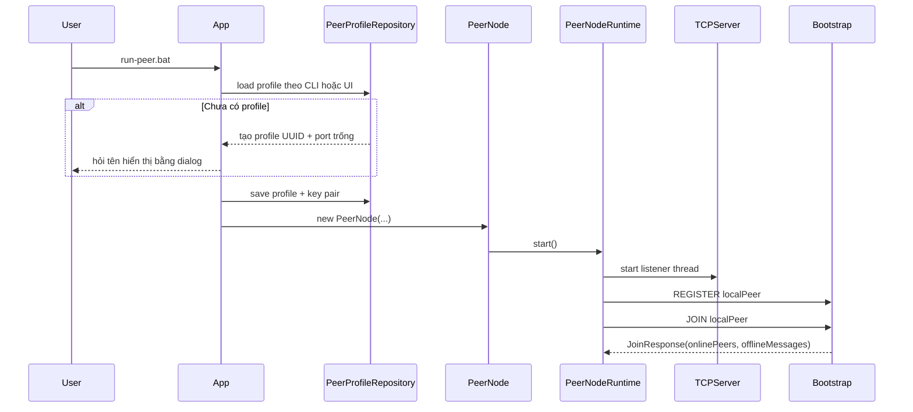
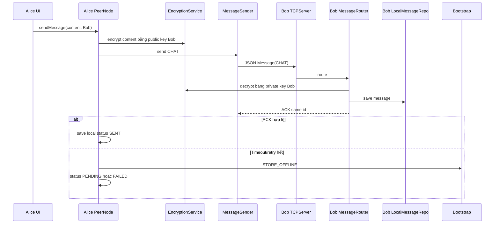
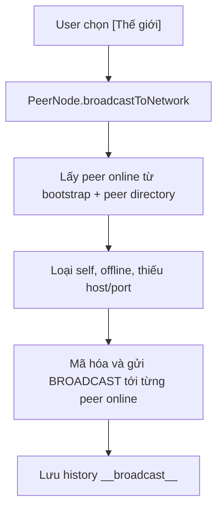

# Báo Cáo Kiến Trúc Hệ Thống

## 1. Tổng Quan

Hệ thống triển khai mô hình **peer-to-peer có bootstrap/tracker hỗ trợ**. Mỗi peer là một process độc lập, vừa có UI để gửi tin, vừa mở TCP server để nhận tin từ peer khác.

Bootstrap server không phải server chat trung tâm. Bootstrap chỉ làm các việc phụ trợ:

- Đăng ký và trả danh sách peer online.
- Lưu trạng thái online/offline tạm thời.
- Lưu metadata group và group member.
- Lưu tin offline khi gửi trực tiếp thất bại.



## 2. Đối Chiếu Yêu Cầu

| Yêu cầu trong `require.md` | Thiết kế / code hiện tại |
| --- | --- |
| Peer tham gia mạng P2P | `App` tạo `PeerNode`, `PeerNodeRuntime` start TCP listener và sync bootstrap. |
| Danh sách peer online | Bootstrap trả `JoinResponse.onlinePeers`, `PeerDirectoryImpl` cập nhật danh bạ runtime. |
| Chat 1-1 trực tiếp | `ChatImpl` gửi `MessageType.CHAT` qua `MessageSender` và `TCPClient`. |
| Chat nhóm | `GroupChatImpl` gửi `GROUP_CHAT` riêng tới từng member. |
| Peer discovery | Bootstrap discovery + fallback `PEER_LIST_REQUEST`. |
| Online/offline | Bootstrap cache peer online với TTL 15 giây; peer refresh mỗi 5 giây. |
| ACK, retry, timeout | `TCPClient` có connect/read timeout; `MessageSender` retry 3 lần; ACK phải trùng message id. |
| Xử lý nhiều kết nối | `TCPServer` và `BootstrapServer` dùng cached thread pool. |
| Store-and-forward | `STORE_OFFLINE`, `OfflineMessageRepo`, drain khi receiver `JOIN`. |
| Broadcast toàn mạng | Conversation `[Thế giới]`, type `BROADCAST`, gửi tới peer online. |
| Mã hóa tin nhắn | RSA-OAEP SHA-256 theo public key của receiver. |

## 3. Module `peer-node`

`peer-node` là ứng dụng desktop Swing và cũng là một P2P node.

| Lớp / package | Trách nhiệm |
| --- | --- |
| `dungcony.ds.App` | Entry point, parse runtime option, chọn/tạo profile, mở UI. |
| `dungcony.ds.app.PeerNode` | Facade cho UI; gom nghiệp vụ chat, group, broadcast, discovery. |
| `PeerNodeFactory` | Tạo và inject các service/repository/network dependency. |
| `PeerNodeRuntime` | Start/stop TCP server và vòng bootstrap sync. |
| `network.TCPServer` | `ServerSocket` lắng nghe port local. |
| `network.ConnectionHandler` | Xử lý một kết nối TCP đến. |
| `network.TCPClient` | Gửi một message tới peer khác và đọc response. |
| `network.MessageSender` | Retry và validate ACK. |
| `services.impl.chat.ChatImpl` | Chat trực tiếp 1-1. |
| `services.impl.group.GroupChatImpl` | Group chat, tạo nhóm, thêm member, đổi tên nhóm. |
| `services.impl.messaging.NetworkBroadcastImpl` | Broadcast `[Thế giới]`. |
| `services.impl.messaging.InboundMessageImpl` | Giải mã và lưu inbound message vào đúng conversation. |
| `services.impl.bootstrap.BootstrapSyncImpl` | Đồng bộ bootstrap, nhóm và offline message. |
| `services.impl.security.RsaMessageEncryptionService` | Mã hóa/giải mã content message. |
| `repositories.LocalMessageRepo` | Lưu và đọc `messages.json`. |
| `repositories.LocalGroupRepo` | Lưu và đọc `groups.json`. |
| `repositories.PeerProfileRepository` | Đọc/ghi/liệt kê profile peer từ filesystem. |

### 3.1. Facade `PeerNode`

UI không gọi trực tiếp socket hoặc repository. UI gọi `PeerNode`, sau đó `PeerNode` ủy quyền cho service phù hợp:

```text
UI -> PeerNode -> ChatService / GroupChatService / NetworkBroadcastService
              -> PeerDirectoryService / ConversationService
              -> MessageSender / repositories / bootstrap gateway
```

Cách tách này giúp UI đơn giản hơn và giúp các nghiệp vụ chat/discovery/test không phụ thuộc Swing.

### 3.2. Dependency Factory

`PeerNodeFactory` tạo toàn bộ dependency của một peer:

- `PeerInfo localPeer` chứa id, name, host, port, public key.
- `PeerKeyStore` nạp hoặc sinh RSA key pair cho profile.
- `RsaMessageEncryptionService` giữ private key local để giải mã.
- `MessageSender`, `TCPClient`, `TCPServer` xử lý network.
- Repository local lưu history và group.
- Gateway bootstrap chia theo interface nhỏ.

## 4. Interface Segregation Với Bootstrap

`BootstrapGateway` kế thừa ba interface nhỏ:

```java
public interface BootstrapGateway
        extends PeerBootstrapGateway, OfflineMessageGateway, GroupBootstrapGateway {
}
```

Trong Java, một interface có thể `extends` nhiều interface. Đây không phải class implementation, mà là cách gom nhiều hợp đồng nhỏ thành một hợp đồng lớn. Code vẫn dùng `implements` ở class thật.

Ý nghĩa thiết kế:

| Interface | Dùng cho |
| --- | --- |
| `PeerBootstrapGateway` | Register/join/leave/list peer. |
| `OfflineMessageGateway` | Store offline message. |
| `GroupBootstrapGateway` | Quản lý metadata group. |
| `BootstrapGateway` | Cổng tổng hợp khi factory cần tạo implementation đầy đủ. |

Service chỉ inject interface nhỏ mình cần. Ví dụ `ChatImpl` chỉ cần `OfflineMessageGateway`, còn `NetworkBroadcastImpl` chỉ cần `PeerBootstrapGateway`.

## 5. Module `bootstrap-server`

`bootstrap-server` là tracker TCP độc lập.

| Lớp / package | Trách nhiệm |
| --- | --- |
| `App` | Entry point bootstrap server. |
| `models.BootstrapServer` | Nhận command TCP một dòng text và dispatch. |
| `models.PeerRegistry` | Cache peer online trong RAM, TTL, offline message, group metadata. |
| `repositories.UserRepo` | Lưu user/peer đã đăng ký và public key. |
| `repositories.GroupRepo` | Lưu group metadata. |
| `repositories.GroupMemberRepo` | Lưu member group theo `userId`. |
| `repositories.OfflineMessageRepo` | Lưu tin offline và đánh dấu delivered. |
| `config.Conn`, `config.Init` | Kết nối SQLite và khởi tạo schema. |

Bootstrap giữ online peers trong RAM vì trạng thái này thay đổi nhanh. SQLite chỉ dùng cho dữ liệu cần tồn tại qua vòng đời process: users, groups, group members, offline messages.

## 6. Luồng Khởi Động Peer



Profile thật được dùng lại tự động. Profile demo `alice`, `bob`, `carol` chỉ dùng khi chạy rõ bằng `--profile` hoặc qua script demo.

## 7. Luồng Chat Trực Tiếp



Message status:

| Status | Ý nghĩa |
| --- | --- |
| `SENT` | Đã nhận ACK hợp lệ. |
| `PENDING` | Gửi trực tiếp thất bại nhưng bootstrap đã lưu offline. |
| `FAILED` | Gửi trực tiếp thất bại và không store offline được, hoặc không mã hóa được cho receiver. |

## 8. Luồng Chat Nhóm

Group không gửi qua một server chat trung tâm. Khi Alice gửi nhóm:

1. `GroupChatImpl` lấy group local.
2. Với từng member, resolve `peer.id` sang `PeerInfo` mới nhất trong `PeerDirectory`.
3. Tạo một message `GROUP_CHAT` riêng cho member đó.
4. Mã hóa content bằng public key của member.
5. Gửi TCP trực tiếp và chờ ACK.
6. Member nào không ACK thì store offline theo `receiverId` nếu bootstrap khả dụng.
7. Local history nhóm lưu dưới conversation ảo `group:<groupId>`.

Membership nhóm được đồng bộ bằng hai kênh:

- Bootstrap lưu group metadata và member id.
- Peer gửi `GROUP_MEMBERS_SYNC` trực tiếp để các peer reachable cập nhật nhanh.

## 9. Luồng Broadcast Toàn Mạng

UI hiển thị broadcast như một conversation riêng `[Thế giới]`.



Broadcast là realtime best-effort:

- Peer online nhận qua TCP và trả ACK.
- Peer offline không nhận lại sau này.
- Broadcast không xuất hiện trong chat riêng.
- Local history lưu bằng `BroadcastConversation.ID = "__broadcast__"`.

## 10. Mã Hóa Tin Nhắn

Mỗi peer profile có một RSA key pair:

| Thành phần | Vị trí |
| --- | --- |
| Public key | Lưu trong profile local, gửi lên bootstrap, gắn trong `PeerInfo`. |
| Private key | Chỉ lưu local trong profile, dùng để giải mã inbound message. |
| Thuật toán | `RSA/ECB/OAEPWithSHA-256AndMGF1Padding`, label `RSA-OAEP-SHA256`. |

Luồng mã hóa:

1. Sender lấy public key của receiver từ discovery.
2. Sender mã hóa `message.content`.
3. Message outbound đặt `encrypted=true`, `encryptionAlgorithm`, `encryptedFor`.
4. Receiver nhận message, dùng private key local để giải mã trước khi lưu history.
5. Nếu gửi offline, bootstrap lưu encrypted content và metadata mã hóa; bootstrap không cần giải mã.

Control message như heartbeat, peer list response và group membership sync không phải nội dung chat nên không đi qua luồng mã hóa payload chat.

## 11. Peer Discovery Và Địa Chỉ Runtime

Hệ thống tách rõ định danh và địa chỉ:

```text
peer.id    -> định danh ổn định của profile/user
host:port  -> địa chỉ runtime để mở socket
publicKey  -> khóa công khai để mã hóa payload
```

Bootstrap trả `PeerInfo(id, name, host, port, online, publicKey)`. Khi gửi message, service không chỉ cần `peer.id`; nó còn cần IP:port để kết nối và public key để mã hóa.

Khi bootstrap không khả dụng, peer vẫn có thể dùng địa chỉ đã biết hoặc hỏi peer đã biết bằng `PEER_LIST_REQUEST`.

## 12. Lưu Trữ

### 12.1. Peer local

```text
runtime-data/peer-node/
├── config.properties
└── <profile-id>/
    ├── config.properties
    ├── messages.json
    └── groups.json
```

| File | Nội dung |
| --- | --- |
| `runtime-data/peer-node/config.properties` | `bootstrap.host`, `bootstrap.port` dùng chung. |
| `<profile>/config.properties` | `peer.id`, `peer.name`, `peer.port`, public key, private key. |
| `<profile>/messages.json` | Direct, group, broadcast history. |
| `<profile>/groups.json` | Group local cache. |

### 12.2. Bootstrap SQLite

```text
runtime-data/bootstrap-server/bootstrap-server.db
```

| Bảng | Nội dung |
| --- | --- |
| `users` | User/peer đã đăng ký, gồm public key. |
| `groups` | Group metadata. |
| `group_members` | Member group theo `userId`. |
| `offline_messages` | Tin chờ giao khi receiver offline, gồm encrypted content nếu có. |

## 13. Xử Lý Đồng Thời

| Nơi phát sinh đồng thời | Cách xử lý |
| --- | --- |
| Nhiều peer kết nối vào một peer | `TCPServer` accept và submit `ConnectionHandler` vào cached thread pool. |
| Nhiều peer gọi bootstrap | `BootstrapServer` dùng cached thread pool. |
| UI listener | `PeerNode` dùng `CopyOnWriteArrayList`. |
| Message history memory | `ConcurrentHashMap` + synchronized list. |
| File JSON local | Repository method `synchronized`. |
| Group membership sync | `CompletableFuture.runAsync`. |

## 14. Quyết Định Thiết Kế

### 14.1. Bootstrap không relay chat online

Điều này giữ đúng tinh thần P2P: chat online đi trực tiếp giữa peer. Bootstrap chỉ hỗ trợ discovery, metadata và offline fallback.

### 14.2. Dùng `peer.id` cho định danh, IP:port cho kết nối

`peer.id` ổn định qua các lần chạy, còn IP:port có thể đổi. Vì vậy danh bạ runtime luôn cần `PeerInfo` đầy đủ khi gửi message.

### 14.3. Broadcast tách khỏi chat riêng

Broadcast `[Thế giới]` là một luồng riêng. Nếu để broadcast rơi vào chat riêng sẽ gây hiểu nhầm giữa tin 1-1 và tin toàn mạng.

### 14.4. Dữ liệu runtime không nằm trong resources

`src/main/resources` dùng cho resource đóng gói cùng app, không phù hợp để chứa history, private key hoặc database phát sinh khi chạy. Dữ liệu runtime được chuyển sang `runtime-data/` và bị `.gitignore`.

## 15. Hạn Chế

- Chưa hỗ trợ NAT traversal, nên demo phù hợp nhất trên cùng máy hoặc cùng LAN có thể mở socket trực tiếp.
- Bootstrap vẫn là điểm phụ thuộc cho discovery tự động và offline message.
- Bootstrap chưa có clustering/replication.
- Broadcast không store offline.
- Offline message được drain khi receiver `JOIN`, chưa có delivered/read receipt đầy đủ sau khi người dùng đọc tin.
