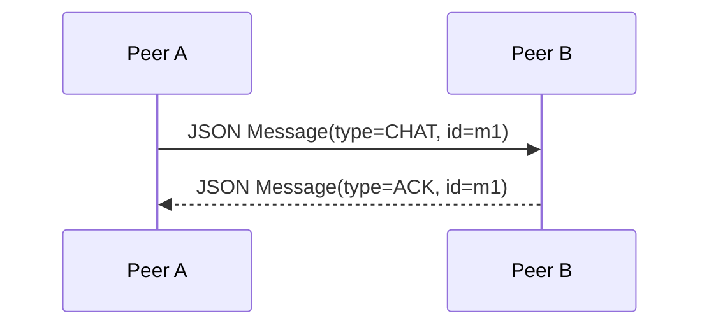
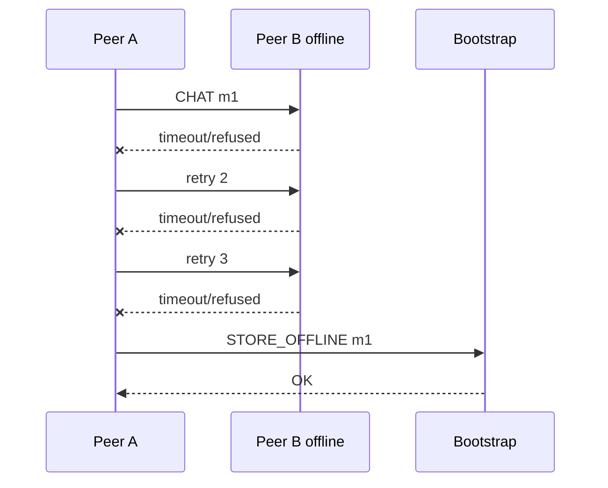
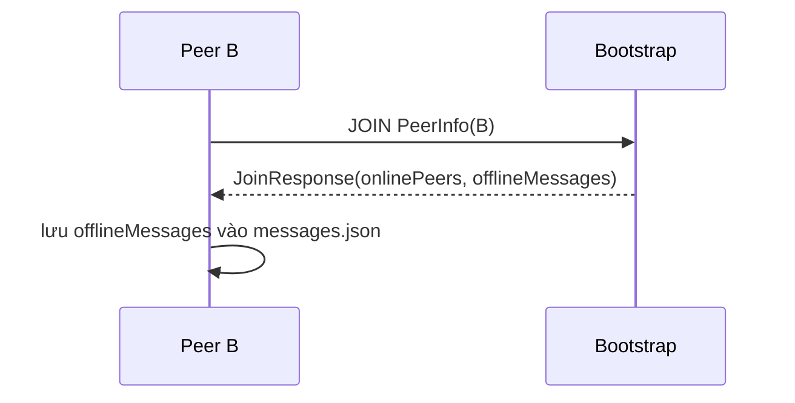
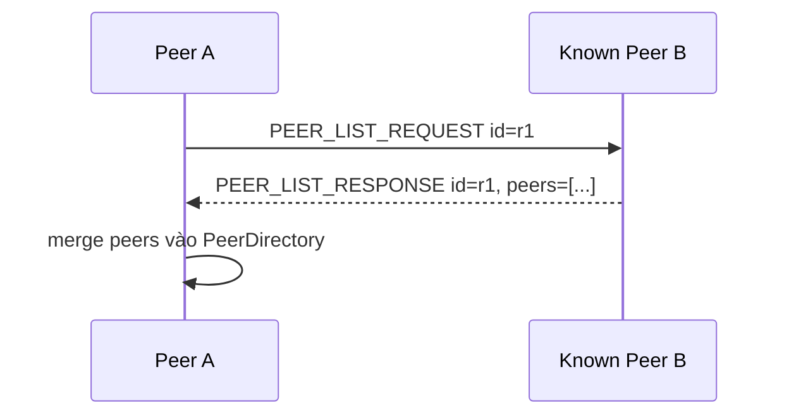

# Giao thức trao đổi thông điệp

## 1. Tổng quan

Hệ thống sử dụng hai lớp giao thức TCP:

| Kênh giao tiếp | Bên tham gia | Định dạng | Mục đích |
| --- | --- | --- | --- |
| Peer-to-peer protocol | `peer-node` với `peer-node` | Một dòng JSON biểu diễn `Message` | Chat 1-1, group chat, broadcast, heartbeat, peer list request, ACK. |
| Bootstrap protocol | `peer-node` với `bootstrap-server` | `COMMAND [JSON_PAYLOAD]` trên một dòng text | Register, join, leave, list peer, group metadata, offline message. |

Cả hai kênh đều dùng TCP Socket, UTF-8 và mô hình request-response đơn giản: client mở socket, gửi một dòng, đọc một dòng response rồi đóng socket.

## 2. Giao thức peer-to-peer

### 2.1. Định dạng transport

Mỗi message peer-to-peer được serialize bằng Gson thành JSON và gửi qua TCP dưới dạng một dòng:

```text
<JSON_MESSAGE>\n
```

Lớp chịu trách nhiệm:

- Serialize/deserialize: `peer-node/src/main/java/dungcony/ds/network/MessageProtocol.java`
- Gửi TCP: `TCPClient.java`
- Nhận TCP: `TCPServer.java`, `ConnectionHandler.java`
- Điều phối message: `MessageReceiver.java`, `MessageRouterImpl.java`

### 2.2. Mô hình kết nối

1. Sender tạo `Socket`.
2. Sender connect tới `receiver.host:receiver.port`.
3. Sender gửi một dòng JSON.
4. Receiver đọc một dòng JSON.
5. Receiver deserialize thành `Message`.
6. Receiver xử lý theo `MessageType`.
7. Receiver trả một dòng JSON response, thường là `ACK`.
8. Hai phía đóng socket.

Thông số timeout hiện tại:

| Tham số | Giá trị | Vị trí |
| --- | --- | --- |
| Connect timeout peer-to-peer | `2000 ms` | `TCPClient.CONNECT_TIMEOUT_MS` |
| Read timeout peer-to-peer | `3000 ms` | `TCPClient.READ_TIMEOUT_MS` |
| Số lần retry | `3` | `MessageSender.RETRY_COUNT` |
| Delay giữa retry | `300 ms` | `MessageSender.RETRY_DELAY_MS` |

### 2.3. Cấu trúc `Message`

Message runtime nằm tại:

```text
peer-node/src/main/java/dungcony/ds/model/Message.java
```

Các field chính:

| Field | Kiểu | Ý nghĩa |
| --- | --- | --- |
| `id` | `String` | UUID của message. ACK phải dùng cùng `id`. |
| `type` | `MessageType` | Loại message: `CHAT`, `GROUP_CHAT`, `ACK`, ... |
| `senderId` | `String` | Định danh ổn định của peer gửi. |
| `senderHost` | `String` | Host/IP của peer gửi. |
| `senderPort` | `int` | Port TCP của peer gửi. |
| `receiverId` | `String` | Định danh peer nhận. |
| `receiverHost` | `String` | Host/IP peer nhận. |
| `receiverPort` | `int` | Port TCP peer nhận. |
| `groupId` | `String` | ID group, dùng cho group chat hoặc group sync. |
| `groupName` | `String` | Tên group. |
| `content` | `String` | Nội dung tin nhắn. |
| `timestamp` | `long` | Thời điểm tạo message, dạng epoch milliseconds. |
| `status` | `MessageStatus` | Trạng thái local: `SENDING`, `SENT`, `PENDING`, `FAILED`. |
| `peers` | `List<PeerInfo>` | Danh sách peer trong `PEER_LIST_RESPONSE`. |
| `groupMembers` | `List<PeerInfo>` | Snapshot member trong `GROUP_MEMBERS_SYNC`. |

Field `fromCurrentUser` là `transient`, chỉ dùng cho UI local và không được serialize vào JSON.

### 2.4. Các loại `MessageType`

Enum nằm tại:

```text
peer-node/src/main/java/dungcony/ds/enums/MessageType.java
```

| MessageType | Mục đích | Response kỳ vọng |
| --- | --- | --- |
| `CHAT` | Tin nhắn 1-1 trực tiếp. | `ACK` cùng `id`. |
| `GROUP_CHAT` | Tin nhắn nhóm gửi tới từng member. | `ACK` cùng `id`. |
| `BROADCAST` | Tin broadcast toàn mạng tới từng peer online. | `ACK` cùng `id`. |
| `PEER_LIST_REQUEST` | Hỏi peer đích danh sách peer mà nó biết. | `PEER_LIST_RESPONSE` cùng `id`. |
| `PEER_LIST_RESPONSE` | Trả danh sách peer đã biết. | `ACK` cùng `id`. |
| `GROUP_MEMBERS_SYNC` | Đồng bộ snapshot thành viên group. | `ACK` cùng `id`. |
| `JOIN` | Thông báo peer tham gia mạng theo đường trực tiếp. | `ACK` cùng `id`. |
| `LEAVE` | Thông báo peer rời mạng theo đường trực tiếp. | `ACK` mặc định nếu được route. |
| `ACK` | Xác nhận đã nhận message. | Không dùng như request chính. |
| `HEARTBEAT` | Kiểm tra peer còn online hay không. | `ACK` cùng `id`. |

### 2.5. ACK và kiểm tra delivery

ACK được tạo bởi:

```java
Message.ack(source, localPeer)
```

Quy tắc ACK hợp lệ:

- `response != null`
- `response.type == ACK`
- `response.id.equals(originalMessage.id)`

Nếu ACK không hợp lệ hoặc timeout, `MessageSender` retry tối đa 3 lần. Sau 3 lần vẫn thất bại, service nghiệp vụ quyết định lưu offline hoặc đánh dấu failed.

### 2.6. Ví dụ message `CHAT`

```json
{
  "id": "2c9d4f8b-7c44-4ed2-93b0-2e5cf1d5a111",
  "type": "CHAT",
  "senderId": "alice",
  "senderHost": "127.0.0.1",
  "senderPort": 5001,
  "receiverId": "bob",
  "receiverHost": "127.0.0.1",
  "receiverPort": 5002,
  "content": "Hello Bob",
  "timestamp": 1716200000000,
  "status": "SENT"
}
```

Response ACK:

```json
{
  "id": "2c9d4f8b-7c44-4ed2-93b0-2e5cf1d5a111",
  "type": "ACK",
  "senderId": "bob",
  "senderHost": "127.0.0.1",
  "senderPort": 5002,
  "receiverId": "alice",
  "receiverHost": "127.0.0.1",
  "receiverPort": 5001,
  "timestamp": 1716200000100,
  "status": "SENT"
}
```

### 2.7. Ví dụ `PEER_LIST_REQUEST` và `PEER_LIST_RESPONSE`

Request:

```json
{
  "id": "request-001",
  "type": "PEER_LIST_REQUEST",
  "senderId": "alice",
  "senderHost": "127.0.0.1",
  "senderPort": 5001,
  "receiverId": "bob",
  "receiverHost": "127.0.0.1",
  "receiverPort": 5002,
  "timestamp": 1716200000000,
  "status": "SENT"
}
```

Response:

```json
{
  "id": "request-001",
  "type": "PEER_LIST_RESPONSE",
  "senderId": "bob",
  "senderHost": "127.0.0.1",
  "senderPort": 5002,
  "receiverId": "alice",
  "receiverHost": "127.0.0.1",
  "receiverPort": 5001,
  "timestamp": 1716200000200,
  "status": "SENT",
  "peers": [
    {
      "id": "bob",
      "name": "Bob",
      "host": "127.0.0.1",
      "port": 5002,
      "online": true
    },
    {
      "id": "carol",
      "name": "Carol",
      "host": "127.0.0.1",
      "port": 5003,
      "online": true
    }
  ]
}
```

### 2.8. Router xử lý message đến

`MessageRouterImpl` ánh xạ `MessageType` sang handler:

| MessageType | Handler chính |
| --- | --- |
| `HEARTBEAT` | Đánh dấu sender online, trả ACK. |
| `PEER_LIST_REQUEST` | Đánh dấu sender online, trả `PEER_LIST_RESPONSE`. |
| `PEER_LIST_RESPONSE` | Merge danh sách peer vào directory, trả ACK. |
| `GROUP_MEMBERS_SYNC` | Đồng bộ group local, trả ACK. |
| `CHAT`, `GROUP_CHAT`, `BROADCAST` | Lưu history, notify UI, trả ACK. |
| `JOIN` | Đánh dấu sender online, trả ACK. |
| Loại khác | Trả ACK mặc định. |

## 3. Giao thức bootstrap

### 3.1. Định dạng transport

Mỗi request gửi tới bootstrap server có dạng:

```text
COMMAND [JSON_PAYLOAD]\n
```

Nếu command không cần payload, client chỉ gửi:

```text
COMMAND\n
```

Bootstrap response luôn là một dòng text:

- `OK` nếu thao tác thành công.
- JSON object/array nếu command cần trả dữ liệu.
- `UNKNOWN_COMMAND` nếu command không được hỗ trợ.
- `null` ở phía client nếu connect/read thất bại.

Lớp liên quan:

- Client: `peer-node/src/main/java/dungcony/ds/network/BootstrapClient.java`
- Server: `bootstrap-server/src/main/java/dungcony/ds/models/BootstrapServer.java`

Timeout bootstrap client:

| Tham số | Giá trị |
| --- | --- |
| Connect timeout | `3000 ms` |
| Read timeout | `5000 ms` |

### 3.2. Danh sách command

| Command | Payload | Response | Mục đích |
| --- | --- | --- | --- |
| `REGISTER` | `PeerInfo` JSON | `OK` | Lưu/cập nhật user vào SQLite, chưa đánh dấu online. |
| `JOIN` | `PeerInfo` JSON | `JoinResponse` JSON | Đánh dấu peer online, trả danh sách peer online và offline message. |
| `LEAVE` | `addressKey` text | `OK` | Xóa peer khỏi registry online runtime. |
| `LIST` | rỗng | JSON array `PeerInfo[]` | Trả danh sách peer online. |
| `STORE_OFFLINE` | `OfflineMessage` JSON | `OK` | Lưu message chờ receiver online lại. |
| `CREATE_GROUP` | `GroupPayload` JSON | `OK` | Tạo/cập nhật metadata group. |
| `ADD_GROUP_MEMBER` | `GroupMemberPayload` JSON | `OK` | Thêm user vào group. |
| `REMOVE_GROUP_MEMBER` | `GroupMemberPayload` JSON | `OK` | Xóa user khỏi group. |
| `LIST_GROUPS` | rỗng | JSON array `GroupPayload[]` | Liệt kê group metadata. |
| `LIST_GROUP_MEMBERS` | `groupId` text | JSON array `GroupMemberPayload[]` | Liệt kê member của một group. |

### 3.3. `PeerInfo`

`PeerInfo` đại diện cho một peer trong danh bạ:

| Field | Ý nghĩa |
| --- | --- |
| `id` | Định danh peer/user ổn định. |
| `name` | Tên hiển thị. |
| `host` | IP/hostname để peer khác kết nối. |
| `port` | Port TCP peer đang lắng nghe. |
| `online` | Trạng thái online runtime. |

Khóa địa chỉ thường dùng là:

```text
host:port
```

### 3.4. Ví dụ `JOIN`

Request:

```text
JOIN {"id":"alice","name":"Alice","host":"127.0.0.1","port":5001,"online":true}
```

Response:

```json
{
  "onlinePeers": [
    {
      "id": "alice",
      "name": "Alice",
      "host": "127.0.0.1",
      "port": 5001,
      "online": true
    },
    {
      "id": "bob",
      "name": "Bob",
      "host": "127.0.0.1",
      "port": 5002,
      "online": true
    }
  ],
  "offlineMessages": []
}
```

### 3.5. Ví dụ `STORE_OFFLINE`

Request:

```text
STORE_OFFLINE {"messageId":"m-001","senderId":"alice","receiverId":"bob","groupId":null,"content":"offline hello","createdAt":1716200000000,"delivered":false}
```

Response:

```text
OK
```

Khi Bob `JOIN`, bootstrap gọi `drainOfflineMessages("bob")`, trả message trong `JoinResponse` và đánh dấu đã giao trong database.

## 4. Luồng giao thức chính

### 4.1. Gửi chat online



### 4.2. Gửi chat khi peer offline



### 4.3. Nhận offline message khi online lại



### 4.4. Discovery fallback không qua bootstrap



## 5. Đảm bảo tính nhất quán và tin cậy cơ bản

| Cơ chế | Cách hoạt động |
| --- | --- |
| Message ID | Mỗi message có UUID, ACK phải trùng ID để tránh nhầm response. |
| ACK | Receiver trả ACK sau khi route và lưu message. |
| Retry | Sender thử lại tối đa 3 lần nếu không nhận ACK/response hợp lệ. |
| Timeout | TCP connect/read có timeout để không treo vô hạn. |
| Offline fallback | Nếu gửi trực tiếp thất bại, sender lưu message lên bootstrap nếu khả dụng. |
| Local persistence | Peer lưu message vào `messages.json`; group lưu vào `groups.json`. |
| Deduplicate local history | Khi cập nhật cùng `messageId`, repository cập nhật record cũ thay vì thêm bản trùng. |

## 6. Hạn chế của giao thức hiện tại

- Payload chưa được mã hóa.
- Chưa có chữ ký số hoặc token xác thực command.
- Bootstrap command là text protocol đơn giản, chưa có versioning.
- Offline delivery được đánh dấu ở bootstrap khi receiver `JOIN`, chưa yêu cầu receiver gửi ACK ngược về bootstrap.
- Mỗi request mở một TCP connection mới; cách này đơn giản nhưng chưa tối ưu cho lưu lượng lớn.
