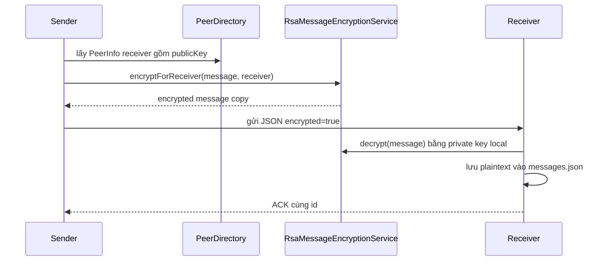
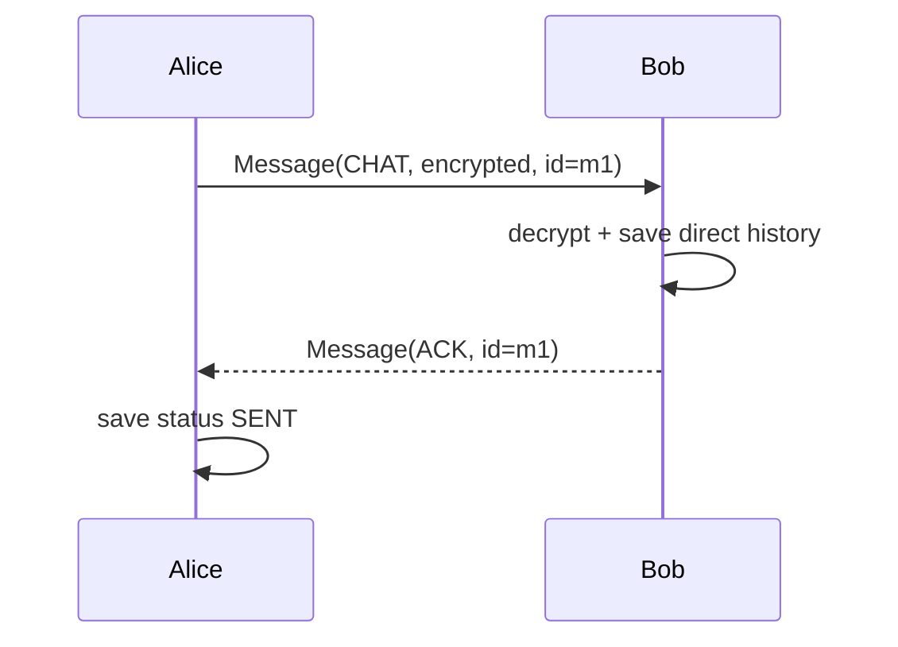
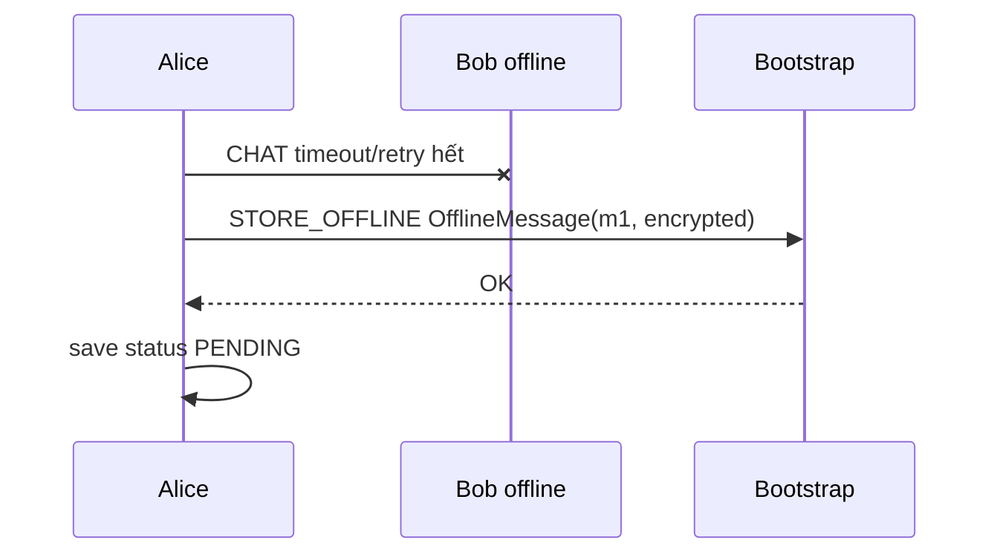
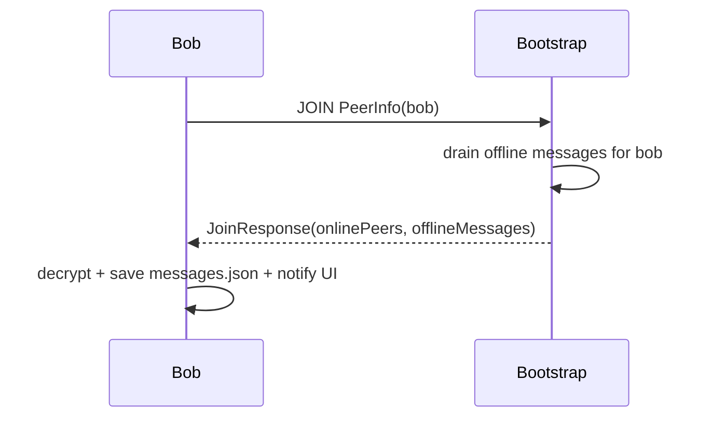
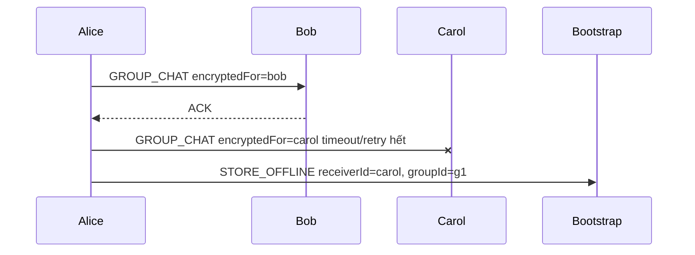
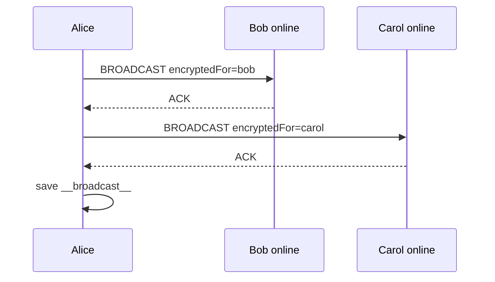

# Giao Thức Trao Đổi Thông Điệp

Hệ thống có hai giao thức TCP:

| Giao thức | Bên tham gia | Payload | Mục đích |
| --- | --- | --- | --- |
| Peer-to-peer protocol | `peer-node` với `peer-node` | Một dòng JSON `Message` | Chat 1-1, group, broadcast, ACK, heartbeat, fallback discovery. |
| Bootstrap protocol | `peer-node` với `bootstrap-server` | Một dòng text `COMMAND [JSON_PAYLOAD]` | Register, join, list peer, group metadata, offline message. |

## 1. Peer-To-Peer Protocol

### 1.1. Định Dạng Truyền

Mỗi lần gửi, `TCPClient` mở một socket tới peer đích, gửi một dòng JSON và chờ một dòng response:

```text
<Message JSON>\n
<Response Message JSON>\n
```

Các lớp liên quan:

| Lớp | Vai trò |
| --- | --- |
| `MessageProtocol` / `Mes` | Serialize/deserialize `Message` bằng Gson. |
| `TCPClient` | Mở socket, gửi payload, đọc response. |
| `TCPServer` | Lắng nghe port local. |
| `ConnectionHandler` | Đọc một dòng request, route, ghi một dòng response. |
| `MessageReceiver` | Chuyển message vào `MessageRouterService`. |
| `MessageRouterImpl` | Phân loại message theo `MessageType`. |

### 1.2. Message Schema

Model chính là `dungcony.ds.model.Message`.

| Field | Kiểu | Ý nghĩa |
| --- | --- | --- |
| `id` | `String` | UUID của message. ACK phải dùng cùng id. |
| `type` | `MessageType` | Loại message. |
| `senderId` | `String` | Định danh ổn định của sender. |
| `senderHost`, `senderPort` | `String`, `int` | Địa chỉ runtime của sender. |
| `senderPublicKey` | `String` | Public key của sender, dùng để peer khác lưu/discover. |
| `receiverId` | `String` | Định danh receiver. |
| `receiverHost`, `receiverPort` | `String`, `int` | Địa chỉ runtime của receiver. |
| `groupId`, `groupName` | `String` | Metadata cho group chat. |
| `content` | `String` | Nội dung tin nhắn; có thể là ciphertext khi `encrypted=true`. |
| `encrypted` | `boolean` | Cho biết `content` đang được mã hóa. |
| `encryptionAlgorithm` | `String` | Ví dụ `RSA-OAEP-SHA256`. |
| `encryptedFor` | `String` | `peer.id` của receiver mà ciphertext được mã hóa cho. |
| `timestamp` | `long` | Thời điểm tạo message. |
| `status` | `MessageStatus` | Trạng thái local: `SENDING`, `SENT`, `PENDING`, `FAILED`. |
| `peers` | `List<PeerInfo>` | Dùng trong `PEER_LIST_RESPONSE`. |
| `groupMembers` | `List<PeerInfo>` | Dùng trong `GROUP_MEMBERS_SYNC`. |

Ví dụ `CHAT` trước khi mã hóa:

```json
{
  "id": "8fb2f5c0-2b2f-4f44-a84f-76a5f80bde11",
  "type": "CHAT",
  "senderId": "alice",
  "senderHost": "127.0.0.1",
  "senderPort": 5001,
  "receiverId": "bob",
  "receiverHost": "127.0.0.1",
  "receiverPort": 5002,
  "content": "hello bob",
  "encrypted": false,
  "timestamp": 1716200000000,
  "status": "SENDING"
}
```

Ví dụ `CHAT` khi gửi qua TCP sau mã hóa:

```json
{
  "id": "8fb2f5c0-2b2f-4f44-a84f-76a5f80bde11",
  "type": "CHAT",
  "senderId": "alice",
  "receiverId": "bob",
  "content": "base64url-ciphertext-chunk",
  "encrypted": true,
  "encryptionAlgorithm": "RSA-OAEP-SHA256",
  "encryptedFor": "bob",
  "timestamp": 1716200000000,
  "status": "SENDING"
}
```

Ví dụ `ACK`:

```json
{
  "id": "8fb2f5c0-2b2f-4f44-a84f-76a5f80bde11",
  "type": "ACK",
  "senderId": "bob",
  "senderHost": "127.0.0.1",
  "senderPort": 5002,
  "receiverId": "alice",
  "receiverHost": "127.0.0.1",
  "receiverPort": 5001,
  "timestamp": 1716200000100,
  "status": "SENT"
}
```

### 1.3. MessageType

| Type | Vai trò | Response |
| --- | --- | --- |
| `CHAT` | Tin nhắn trực tiếp 1-1. | `ACK` cùng id. |
| `GROUP_CHAT` | Tin nhắn nhóm gửi tới một member. | `ACK` cùng id. |
| `BROADCAST` | Tin `[Thế giới]` gửi tới peer online. | `ACK` cùng id. |
| `PEER_LIST_REQUEST` | Hỏi danh sách peer mà peer đích biết. | `PEER_LIST_RESPONSE` cùng id. |
| `PEER_LIST_RESPONSE` | Trả danh sách peer đã biết. | `ACK` cùng id nếu được route như message inbound. |
| `GROUP_MEMBERS_SYNC` | Đồng bộ snapshot thành viên nhóm. | `ACK` cùng id. |
| `JOIN` | Control message trực tiếp, đánh dấu sender online. | `ACK` cùng id. |
| `LEAVE` | Control message trực tiếp. | `ACK` mặc định. |
| `HEARTBEAT` | Kiểm tra peer còn reachable không. | `ACK` cùng id. |
| `ACK` | Xác nhận đã xử lý message. | Không dùng như request nghiệp vụ. |

## 2. ACK, Timeout Và Retry

`TCPClient` cấu hình:

| Giá trị | Mặc định |
| --- | --- |
| Connect timeout | `2000 ms` |
| Read timeout | `3000 ms` |

`MessageSender` cấu hình:

| Giá trị | Mặc định |
| --- | --- |
| Số lần retry | `3` |
| Delay giữa retry | `300 ms` |

ACK hợp lệ khi:

```text
response != null
response.type == ACK
response.id == request.id
```

Nếu response null, sai type hoặc sai id, sender retry. Sau khi retry hết:

- Direct chat: store offline nếu bootstrap khả dụng.
- Group chat: store offline theo từng member nếu bootstrap khả dụng.
- Broadcast: không store offline, chỉ ghi kết quả delivered/failed.

## 3. Mã Hóa Payload

### 3.1. Key Management

Mỗi peer profile có RSA key pair trong:

```text
runtime-data/peer-node/<profile>/config.properties
```

Các property chính:

```properties
peer.publicKey=...
peer.privateKey=...
```

Public key được đưa vào `PeerInfo` và gửi lên bootstrap khi `REGISTER/JOIN`. Private key chỉ lưu local và dùng để giải mã inbound message.

### 3.2. Thuật Toán

| Thành phần | Giá trị |
| --- | --- |
| Key algorithm | `RSA` |
| Key size | `2048 bit` |
| Cipher transformation | `RSA/ECB/OAEPWithSHA-256AndMGF1Padding` |
| Label lưu trong message | `RSA-OAEP-SHA256` |

`RsaMessageEncryptionService` chia content thành nhiều chunk khi nội dung dài hơn kích thước plaintext tối đa của RSA-OAEP.

### 3.3. Luồng Mã Hóa



Nếu receiver thiếu public key hoặc public key không hợp lệ:

- Direct chat đánh dấu `FAILED` và không gửi plaintext.
- Group/broadcast coi target đó là gửi thất bại.
- Offline store chỉ được thực hiện khi đã có outbound message mã hóa hợp lệ.

Bootstrap không giải mã offline message; nó chỉ lưu ciphertext và metadata.

## 4. Luồng Xử Lý Message Đến

`MessageRouterImpl` route theo `MessageType`, còn `InboundMessageImpl` xử lý message nội dung:

| Type | Xử lý |
| --- | --- |
| `HEARTBEAT` | Mark sender online, trả ACK. |
| `PEER_LIST_REQUEST` | Mark sender online, trả `PEER_LIST_RESPONSE`. |
| `PEER_LIST_RESPONSE` | Merge peer list vào directory, trả ACK. |
| `GROUP_MEMBERS_SYNC` | Sync group members local, trả ACK. |
| `CHAT` | Giải mã content, lưu direct history, notify UI, trả ACK. |
| `GROUP_CHAT` | Giải mã content, lưu group history, tạo/sync group local nếu cần, trả ACK. |
| `BROADCAST` | Giải mã content, lưu vào history `[Thế giới]`, notify UI, trả ACK. |
| `JOIN` | Mark sender online, trả ACK. |
| Loại khác | Trả ACK mặc định. |

## 5. Các Luồng P2P Chính

### 5.1. Chat 1-1 Online



### 5.2. Chat 1-1 Offline



### 5.3. Nhận Offline Message



### 5.4. Group Chat



### 5.5. Broadcast `[Thế giới]`



Broadcast không lưu offline. Peer offline tại thời điểm gửi sẽ bỏ lỡ tin đó.

## 6. Bootstrap Protocol

### 6.1. Định Dạng

Mỗi request tới bootstrap là một dòng text:

```text
COMMAND [JSON_PAYLOAD]\n
```

Response là một dòng text:

- `"OK"` nếu command cập nhật thành công.
- JSON nếu command trả dữ liệu.
- `"UNKNOWN_COMMAND"` nếu command không hỗ trợ.
- `null` ở phía client nếu không kết nối được.

### 6.2. PeerInfo

`PeerInfo` là dữ liệu bootstrap dùng để nhận diện và trả danh sách peer:

| Field | Ý nghĩa |
| --- | --- |
| `id` | `peer.id` ổn định. |
| `name` | Tên hiển thị. |
| `host`, `port` | Địa chỉ runtime để peer khác kết nối TCP. |
| `online` | Trạng thái online trong tracker. |
| `publicKey` | Public key để peer khác mã hóa payload. |

### 6.3. Command Peer Discovery

| Command | Payload | Response | Ý nghĩa |
| --- | --- | --- | --- |
| `REGISTER` | `PeerInfo` JSON | `OK` | Lưu/cập nhật user và public key, chưa bắt buộc online. |
| `JOIN` | `PeerInfo` JSON | `JoinResponse` JSON | Đánh dấu online, trả online peers + offline messages. |
| `LEAVE` | `addressKey` text | `OK` | Xóa peer khỏi online registry. |
| `LIST` | Rỗng | `PeerInfo[]` JSON | Lấy danh sách peer online. |

`JoinResponse`:

```json
{
  "onlinePeers": [
    {
      "id": "bob",
      "name": "Bob",
      "host": "127.0.0.1",
      "port": 5002,
      "online": true,
      "publicKey": "base64-public-key"
    }
  ],
  "offlineMessages": []
}
```

### 6.4. Command Offline Message

| Command | Payload | Response | Ý nghĩa |
| --- | --- | --- | --- |
| `STORE_OFFLINE` | `OfflineMessage` JSON | `OK` | Lưu tin chờ giao theo `receiverId`. |

`OfflineMessage` lưu cả metadata mã hóa:

```json
{
  "messageId": "m1",
  "senderId": "alice",
  "receiverId": "bob",
  "groupId": null,
  "content": "base64url-ciphertext",
  "createdAt": 1716200000000,
  "delivered": false,
  "encrypted": true,
  "encryptionAlgorithm": "RSA-OAEP-SHA256",
  "encryptedFor": "bob"
}
```

Bootstrap trả offline message trong lần `JOIN` tiếp theo của receiver và đánh dấu delivered.

### 6.5. Command Group Metadata

| Command | Payload | Response | Ý nghĩa |
| --- | --- | --- | --- |
| `CREATE_GROUP` | `GroupPayload` JSON | `OK` | Tạo/cập nhật group metadata. |
| `ADD_GROUP_MEMBER` | `GroupMemberPayload` JSON | `OK` | Thêm user vào group. |
| `LIST_GROUPS` | Rỗng | `GroupPayload[]` JSON | Lấy danh sách group metadata. |
| `LIST_GROUP_MEMBERS` | `groupId` text | `GroupMemberPayload[]` JSON | Lấy member của group. |
| `REMOVE_GROUP_MEMBER` | `GroupMemberPayload` JSON | `OK` | Bootstrap có support, UI hiện tại không dùng làm luồng chính. |

## 7. Tính Đúng Đắn Của Giao Thức

| Vấn đề | Cách xử lý |
| --- | --- |
| Tránh nhầm ACK | ACK phải giữ nguyên `message.id`. |
| Peer tắt đột ngột | Socket timeout, retry, fallback offline. |
| Nhiều kết nối đồng thời | Peer và bootstrap dùng thread pool. |
| Group chỉ lưu id nhưng gửi cần IP:port | Runtime resolve id sang `PeerInfo` từ bootstrap/danh bạ. |
| Payload không được gửi plaintext | Content-bearing message được mã hóa trước khi gửi nếu có public key receiver. |
| Broadcast lẫn chat riêng | `LocalMessageRepo` lưu broadcast riêng ở `__broadcast__`. |
| Bootstrap lỗi | Peer vẫn chạy TCP trực tiếp với peer đã biết; không có discovery/offline store mới. |
