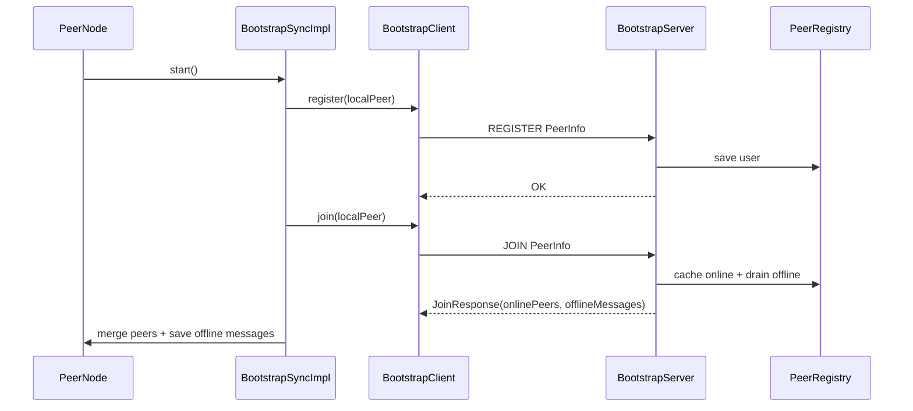
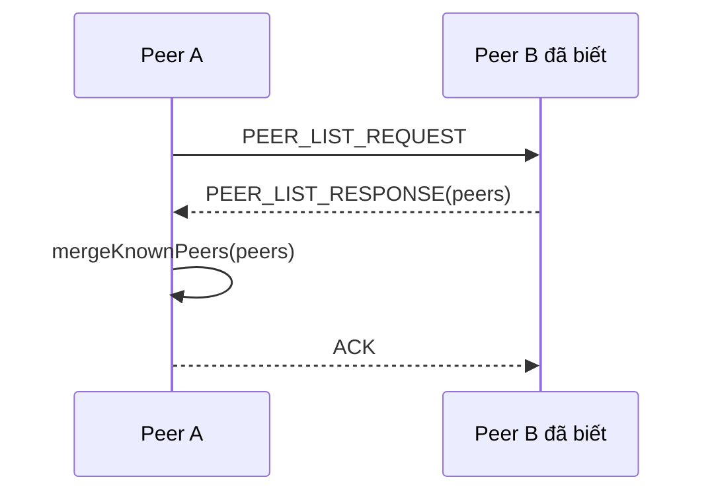

# Cơ Chế Peer Discovery

Peer discovery là cơ chế giúp peer mới tìm được peer khác trong mạng và có đủ địa chỉ IP:port để mở TCP socket trực tiếp.

Hệ thống dùng hai lớp discovery:

1. Discovery chính qua bootstrap/tracker.
2. Discovery fallback qua peer đã biết bằng `PEER_LIST_REQUEST`.

## 1. Vì Sao Cần Discovery

Trong P2P chat, message online không đi qua server trung tâm. Sender phải biết địa chỉ network của receiver:

```text
peer.id  -> định danh ổn định
host:port -> địa chỉ runtime để mở socket và nhận ACK
```

Vì vậy chỉ lưu `peer.id` là không đủ để gửi tin. `peer.id` dùng để nhận diện người dùng/profile; IP:port lấy từ bootstrap hoặc danh bạ runtime.

## 2. Discovery Qua Bootstrap

Bootstrap server đóng vai trò tracker:

- Nhận `REGISTER` để lưu user.
- Nhận `JOIN` để đánh dấu peer online.
- Trả danh sách peer online trong `JoinResponse`.
- Nhận `LEAVE` để xóa peer khỏi registry.
- Loại peer quá hạn bằng TTL nếu peer không refresh.



## 3. Vòng Đời Online/Offline

### 3.1. Khi peer start

`PeerNodeRuntime.start()` làm hai việc:

1. Tạo thread `PeerNode-TCPServer-<port>` để lắng nghe TCP.
2. Tạo thread `PeerNode-Bootstrap` để chạy `BootstrapSyncImpl`.

`BootstrapSyncImpl.registerAndJoinBootstrap()`:

1. Gửi `REGISTER localPeer`.
2. Gửi `JOIN localPeer`.
3. Nhận online peers.
4. Sync group metadata.
5. Nhận offline messages.
6. Notify UI refresh danh sách chat.

### 3.2. Khi peer đang chạy

`PeerNode-Bootstrap` lặp mỗi `5000 ms`:

```text
JOIN localPeer -> nhận danh sách online mới -> sync vào PeerDirectory
```

Bootstrap giữ TTL online:

| Giá trị | Mặc định |
| --- | --- |
| Peer refresh interval | `5000 ms` |
| Bootstrap online TTL | `15000 ms` |

Nếu peer tắt đột ngột và không gửi `LEAVE`, bootstrap sẽ loại peer đó khỏi danh sách online sau TTL.

### 3.3. Khi peer đóng app

`PeerNode.stop()`:

1. Gửi `LEAVE <host:port>` lên bootstrap.
2. Dừng `TCPServer`.
3. Shutdown connection pool.

## 4. PeerDirectory

`PeerDirectoryService` là danh bạ runtime trong peer-node.

Nó lưu các peer từ nhiều nguồn:

| Nguồn | Ví dụ |
| --- | --- |
| Bootstrap `JOIN/LIST` | Peer online hiện tại. |
| Message inbound | Sender của `CHAT`, `GROUP_CHAT`, `BROADCAST`, `HEARTBEAT`. |
| Local history | Peer đã từng có direct chat. |
| Fallback discovery | Peer list từ `PEER_LIST_RESPONSE`. |
| Người dùng nhập địa chỉ thủ công | Trang "Chat trực tiếp". |

Danh bạ này giúp hệ thống resolve:

```text
peer.id -> PeerInfo(id, name, host, port, online)
```

Khi gửi group, member được lưu theo id, nhưng `GroupChatImpl` gọi `findKnownPeerById()` để lấy IP:port mới nhất.

## 5. Discovery Fallback Qua Peer Đã Biết

Khi bootstrap không khả dụng hoặc khi peer chỉ biết một địa chỉ thủ công, peer có thể hỏi peer đã biết:



Luồng này không thay thế bootstrap hoàn toàn, nhưng giúp hệ thống không phụ thuộc tuyệt đối vào tracker trong mọi tình huống.

## 6. Discovery Cho Group

Group metadata trên bootstrap lưu member theo `userId`/`peer.id`, không lưu cố định IP:port vì địa chỉ runtime có thể đổi.

Khi peer refresh bootstrap:

1. Lấy danh sách group metadata bằng `LIST_GROUPS`.
2. Lấy member từng group bằng `LIST_GROUP_MEMBERS`.
3. Ghép member id với peer online hiện biết.
4. Cập nhật `groups.json`.

Khi tạo/thêm member/đổi tên group, peer còn gửi `GROUP_MEMBERS_SYNC` trực tiếp tới member reachable để cập nhật nhanh mà không phải chờ vòng refresh.

## 7. Discovery Cho Broadcast `[Thế giới]`

`NetworkBroadcastImpl` lấy target như sau:

1. Gọi bootstrap `LIST` nếu bootstrap khả dụng.
2. Merge danh sách online vào `PeerDirectory`.
3. Hợp nhất với peer đã biết trong runtime.
4. Loại bỏ:
   - local peer,
   - peer offline,
   - peer thiếu host/port,
   - peer trùng id/address.
5. Gửi `BROADCAST` tới target còn lại.

Broadcast không cần group membership và không lưu offline. Đây là luồng realtime "ai đang online thì nhận".

## 8. UI Và Trạng Thái Online

Chat list hiển thị:

- `[Thế giới]` cho broadcast.
- `[Nhóm] <name>` cho group.
- Peer trực tiếp với chấm online/offline.

Trạng thái online chủ yếu lấy từ bootstrap/danh bạ runtime. Khi bootstrap mất kết nối, peer vẫn có thể chat trực tiếp tới địa chỉ đã biết, nhưng trạng thái online tự động có thể không chính xác bằng khi tracker hoạt động.

## 9. Trường Hợp Lỗi

| Tình huống | Hành vi |
| --- | --- |
| Bootstrap chưa chạy | Peer vẫn mở TCP listener, nhưng không có discovery tự động/offline store. |
| Peer không gửi `LEAVE` | Bootstrap loại peer sau TTL. |
| Peer đổi port | Lần `JOIN` mới cập nhật `PeerInfo` trên bootstrap. |
| Group member chỉ có id, chưa có địa chỉ | Không thể gửi trực tiếp cho member đó cho tới khi discovery được IP:port. |
| Peer offline trong broadcast | Bỏ qua, không store offline. |

## 10. Đánh Giá

Cơ chế discovery đáp ứng yêu cầu:

- Peer mới tìm được peer khác qua tracker.
- Danh sách peer online được cập nhật định kỳ.
- Mỗi peer vẫn tự giao tiếp trực tiếp bằng TCP sau khi có IP:port.
- Có fallback peer-to-peer khi bootstrap không khả dụng.
- Group sử dụng `peer.id` ổn định nhưng vẫn resolve sang IP:port tại thời điểm gửi.

