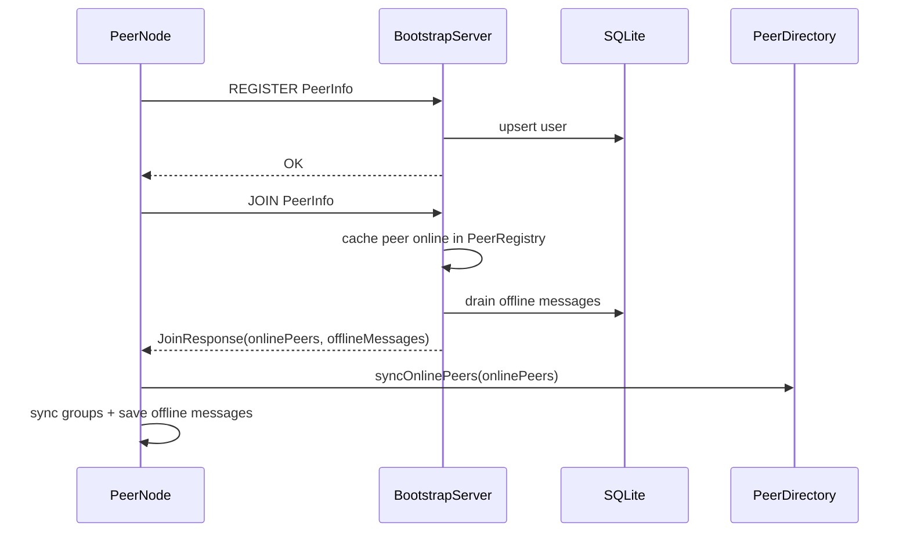
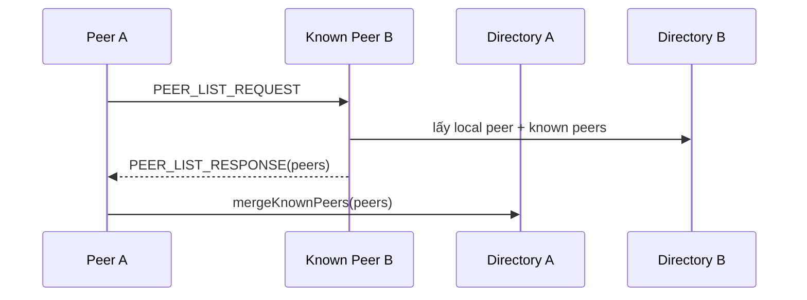
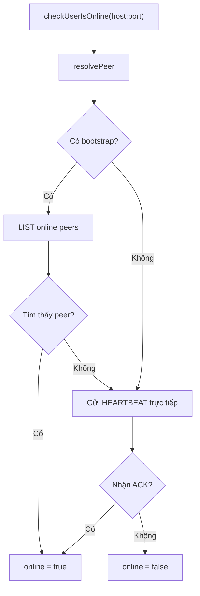

# Cơ chế peer discovery

## 1. Mục tiêu

Peer discovery giúp một peer mới tham gia mạng tìm được các peer khác để chat. Hệ thống triển khai hai cơ chế:

1. Discovery qua `bootstrap-server`: cơ chế chính.
2. Discovery trực tiếp qua peer đã biết: cơ chế fallback khi bootstrap không khả dụng hoặc khi người dùng nhập thủ công địa chỉ peer.

## 2. Dữ liệu định danh peer

Mỗi peer được biểu diễn bởi `PeerInfo`:

| Thuộc tính | Ý nghĩa |
| --- | --- |
| `id` | Định danh ổn định của user/peer. |
| `name` | Tên hiển thị trong UI. |
| `host` | Host/IP để peer khác kết nối. |
| `port` | Port TCP mà peer lắng nghe. |
| `online` | Trạng thái online do bootstrap hoặc heartbeat xác nhận. |

Khóa địa chỉ runtime:

```text
addressKey = host + ":" + port
```

`PeerDirectoryImpl` lưu danh bạ peer runtime bằng `ConcurrentHashMap`, đồng thời loại bỏ peer trùng `id` nhưng khác địa chỉ khi peer đổi port/host.

## 3. Discovery qua bootstrap server

### 3.1. Vai trò bootstrap

`bootstrap-server` đóng vai trò tracker:

- Nhận `REGISTER` để lưu user vào SQLite.
- Nhận `JOIN` để đánh dấu peer online.
- Trả danh sách peer online cho peer vừa join.
- Nhận `LEAVE` để xóa peer khỏi registry online.
- Nhận `LIST` để trả danh sách peer online hiện tại.
- Lưu offline message và group metadata để peer mới/peer join lại có thể đồng bộ.

Bootstrap không chuyển tiếp tin nhắn online giữa các peer.

### 3.2. Luồng peer join mạng



Code chính:

| Thành phần | Lớp |
| --- | --- |
| Client gọi bootstrap | `BootstrapClient` |
| Vòng join/refresh | `BootstrapSyncImpl`, `PeerNodeRuntime` |
| Server xử lý command | `BootstrapServer` |
| Registry online | `PeerRegistry` |

### 3.3. Refresh định kỳ

Sau khi peer start, `PeerNodeRuntime` chạy vòng `runBootstrapSyncLoop()`:

1. Gọi `registerAndJoinBootstrap()` một lần khi khởi động.
2. Cứ mỗi `5000 ms`, gọi `refreshFromBootstrap()`.
3. Mỗi lần refresh gửi `JOIN` lại để cập nhật `lastSeen` trên bootstrap.
4. Peer nhận lại:
   - Danh sách peer online.
   - Group metadata mà peer tham gia.
   - Offline messages nếu có.

Thông số:

| Tham số | Giá trị | Ý nghĩa |
| --- | --- | --- |
| `BOOTSTRAP_REFRESH_INTERVAL_MS` | `5000 ms` | Peer refresh bootstrap định kỳ. |
| `ONLINE_TTL_MS` | `15000 ms` | Bootstrap loại peer quá hạn khỏi online registry. |

### 3.4. Quản lý online/offline ở bootstrap

`PeerRegistry` lưu peer online trong RAM:

```text
Map<String, PeerInfo> peers
Map<String, Long> lastSeenByPeerKey
```

Khi nhận `JOIN`:

- Bootstrap lưu/cập nhật user vào SQLite.
- Đặt `peer.online = true`.
- Cập nhật `peers[addressKey]`.
- Cập nhật `lastSeenByPeerKey[addressKey] = currentTimeMillis`.

Khi nhận `LEAVE`:

- Xóa peer khỏi `peers`.
- Xóa peer khỏi `lastSeenByPeerKey`.

Khi gọi `LIST` hoặc `JOIN`, registry chạy `evictExpiredPeers()` để loại peer có `lastSeen` cũ hơn TTL.

## 4. Đồng bộ danh bạ peer ở peer-node

Peer lưu danh bạ runtime trong `PeerDirectoryImpl`.

### 4.1. Khi nhận danh sách từ bootstrap

`syncOnlinePeers(onlinePeers)`:

1. Đánh dấu tất cả peer đã biết là offline.
2. Bỏ qua local peer.
3. Với từng peer bootstrap trả về:
   - Đặt `online = true`.
   - Ghi vào danh bạ runtime.
4. Notify UI refresh.

Cách này giúp UI thấy peer không còn xuất hiện trong bootstrap là offline.

### 4.2. Khi nhận message trực tiếp

Nếu peer nhận `CHAT`, `GROUP_CHAT`, `BROADCAST`, `HEARTBEAT`, `JOIN`, router sẽ gọi `markPeerOnline()` hoặc `onInboundMessage()`. Sender được merge vào danh bạ để peer nhận vẫn biết người gửi ngay cả khi bootstrap đang lỗi.

## 5. Discovery fallback qua peer đã biết

### 5.1. Mục đích

Khi bootstrap không khả dụng, peer vẫn có thể mở rộng danh bạ bằng cách hỏi một peer đã biết danh sách peer mà peer đó đang biết.

### 5.2. Luồng hoạt động



Lớp triển khai:

- `PeerDiscoverImpl.discoverPeersFromKnownPeer()`
- `PeerDiscoverImpl.buildPeerListResponse()`
- `PeerDiscoverImpl.onPeerListResponse()`
- `MessageRouterImpl` route `PEER_LIST_REQUEST` và `PEER_LIST_RESPONSE`.

### 5.3. Quy tắc lọc peer

Khi merge danh sách peer:

- Bỏ qua peer `null`.
- Bỏ qua local peer.
- Bỏ qua pseudo peer đại diện group (`host` bắt đầu bằng `group:`).
- Tránh trùng bằng `id` hoặc `addressKey`.

## 6. Kiểm tra trạng thái online

`PeerPresenceImpl.checkUserIsOnline()` dùng hai bước:

1. Hỏi bootstrap bằng `LIST`, so khớp theo `id` hoặc `host:port`.
2. Nếu bootstrap không xác nhận, gửi `HEARTBEAT` trực tiếp tới peer đích.

Luồng:



## 7. Discovery group metadata

Ngoài peer online, bootstrap còn hỗ trợ discovery thông tin nhóm:

| Command | Ý nghĩa |
| --- | --- |
| `CREATE_GROUP` | Tạo/cập nhật group metadata. |
| `ADD_GROUP_MEMBER` | Thêm user vào group. |
| `LIST_GROUPS` | Lấy toàn bộ group metadata. |
| `LIST_GROUP_MEMBERS` | Lấy danh sách member của group. |

Peer gọi `BootstrapGroupImpl.fetchJoinedGroups()` để lấy các group mà local peer là thành viên. Sau đó `GroupManager.replaceAll()` cập nhật cache local và ghi `groups.json`.

Ngoài bootstrap, peer còn gửi `GROUP_MEMBERS_SYNC` trực tiếp tới các member để UI của peer khác cập nhật membership nhanh hơn.

## 8. Hoạt động khi bootstrap không khả dụng

Nếu bootstrap server không chạy:

- Peer vẫn khởi động được.
- `REGISTER`/`JOIN` thất bại thì peer chuyển sang chế độ TCP trực tiếp.
- Người dùng vẫn có thể thêm peer bằng địa chỉ `host:port`.
- Có thể dùng `PEER_LIST_REQUEST` để hỏi peer đã biết.
- Offline message và group sync qua bootstrap không hoạt động.

Điều này giữ một phần tính P2P: bootstrap giúp tiện hơn nhưng không bắt buộc cho mọi giao tiếp trực tiếp.

## 9. Kịch bản discovery mẫu

### 9.1. Discovery qua bootstrap

1. Chạy bootstrap server.
2. Chạy Bob ở port `5002`.
3. Bob gửi `REGISTER` và `JOIN`.
4. Bootstrap lưu Bob online.
5. Chạy Alice ở port `5001`.
6. Alice `JOIN` và nhận danh sách có Bob.
7. Alice merge Bob vào danh bạ và UI hiển thị Bob online.

### 9.2. Discovery fallback

1. Alice biết địa chỉ Bob: `127.0.0.1:5002`.
2. Alice gửi `PEER_LIST_REQUEST` tới Bob.
3. Bob trả `PEER_LIST_RESPONSE` gồm local peer Bob và các peer Bob đã biết.
4. Alice merge danh sách này vào `PeerDirectory`.

### 9.3. Peer offline do TTL

1. Bob tắt ứng dụng đột ngột, không gửi `LEAVE`.
2. Bootstrap không còn nhận `JOIN` refresh từ Bob.
3. Sau khoảng `ONLINE_TTL_MS = 15000 ms`, Bob bị xóa khỏi registry online.
4. Lần `LIST`/`JOIN` sau, Alice không còn thấy Bob online.

## 10. Ưu điểm và hạn chế

### Ưu điểm

- Cơ chế discovery đơn giản, dễ kiểm thử.
- Peer vẫn có thể chat trực tiếp nếu biết địa chỉ nhau.
- Bootstrap giảm thao tác nhập thủ công địa chỉ.
- TTL giúp xử lý trường hợp peer tắt đột ngột.
- Fallback discovery qua peer khác giúp hệ thống không phụ thuộc hoàn toàn vào tracker.

### Hạn chế

- Chưa hỗ trợ NAT traversal hoặc hole punching.
- Bootstrap hiện là một điểm phụ thuộc đơn cho discovery tự động.
- Chưa có xác thực peer nên peer giả mạo `id` vẫn có thể gửi request nếu truy cập được mạng.
- Trạng thái online là best-effort, phụ thuộc refresh interval, TTL và heartbeat.

## 11. Đề xuất cải tiến

- Thêm nhiều bootstrap server và cơ chế failover.
- Thêm token/session để xác thực `REGISTER` và `JOIN`.
- Thêm DHT hoặc gossip discovery để giảm phụ thuộc bootstrap.
- Lưu danh bạ peer bền vững hơn để restart vẫn còn known peers.
- Thêm NAT traversal cho môi trường khác LAN.
