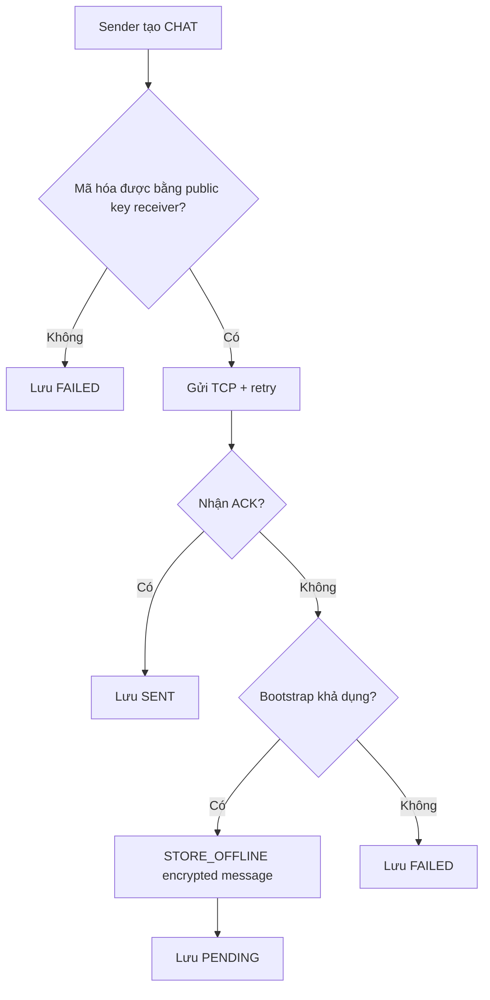

# Xử Lý Lỗi Và Thử Nghiệm Hệ Thống

Tài liệu này mô tả các lỗi chính trong hệ thống P2P Chat, cách code xử lý và các test dùng để chứng minh yêu cầu.

## 1. Nhóm Lỗi Chính

| Nhóm lỗi | Ví dụ |
| --- | --- |
| Lỗi kết nối peer | Peer đích tắt, port sai, timeout, không ACK. |
| Lỗi bootstrap | Tracker chưa chạy, mất kết nối, không store offline được. |
| Lỗi dữ liệu local | File JSON rỗng, record message lỗi, profile thiếu config, group local không có trên bootstrap. |
| Lỗi trạng thái phân tán | Peer tắt đột ngột, danh sách online chưa refresh. |
| Lỗi mã hóa | Receiver thiếu public key, key pair local không hợp lệ, không giải mã được payload. |
| Lỗi UI/luồng người dùng | Chưa có profile thật, chỉ có demo profile, gửi nhầm broadcast vào chat riêng. |

## 2. Xử Lý Lỗi Kết Nối Peer

### 2.1. Timeout Socket

`TCPClient` dùng timeout để tránh treo luồng gửi:

| Timeout | Giá trị |
| --- | --- |
| Connect timeout | `2000 ms` |
| Read timeout | `3000 ms` |

Nếu connect/read lỗi, `TCPClient` trả `null`. Tầng service không throw thẳng ra UI.

### 2.2. ACK Và Retry

`MessageSender` retry tối đa 3 lần. Một response chỉ được coi là thành công khi:

```text
response != null
response.type == ACK
response.id == request.id
```

Nếu không hợp lệ, sender đợi `300 ms` rồi retry.

### 2.3. Trạng Thái Message

| Status | Khi nào xuất hiện | Ý nghĩa |
| --- | --- | --- |
| `SENDING` | Message mới tạo trước khi có kết quả gửi. | Trạng thái tạm thời. |
| `SENT` | Nhận ACK hợp lệ. | Peer đích đã xử lý message. |
| `PENDING` | Gửi trực tiếp thất bại nhưng bootstrap lưu offline thành công. | Receiver sẽ nhận khi `JOIN` lại. |
| `FAILED` | Không ACK và không store offline được, hoặc không mã hóa được. | Người dùng cần thử lại khi peer/bootstrap/key sẵn sàng. |

## 3. Xử Lý Peer Offline

### 3.1. Peer Tắt Bình Thường

Khi đóng cửa sổ app:

1. `PeerNode.stop()` được gọi.
2. Peer gửi `LEAVE <host:port>` lên bootstrap.
3. Bootstrap xóa peer khỏi `PeerRegistry`.
4. `TCPServer` của peer đóng socket.

### 3.2. Peer Tắt Đột Ngột

Nếu peer không gửi `LEAVE`, bootstrap vẫn loại peer sau TTL:

```text
ONLINE_TTL_MS = 15000 ms
```

Peer khác refresh mỗi 5 giây bằng `JOIN`, nên UI sẽ dần cập nhật offline.

### 3.3. Gửi Chat 1-1 Tới Peer Offline



Khi receiver online lại và `JOIN`, bootstrap trả offline messages trong `JoinResponse`.

### 3.4. Gửi Group Tới Member Offline

Group chat gửi tới từng member. Member nào nhận ACK thì coi là delivered. Member nào không ACK thì sender store offline theo `receiverId` nếu bootstrap khả dụng và outbound message đã được mã hóa hợp lệ.

### 3.5. Broadcast Tới Peer Offline

Broadcast `[Thế giới]` không store offline. Đây là quyết định thiết kế: broadcast là chat realtime toàn mạng, peer offline bỏ lỡ tin.

## 4. Xử Lý Bootstrap Không Khả Dụng

Bootstrap không phải chat server trung tâm, nên peer vẫn có thể hoạt động một phần:

| Chức năng | Khi bootstrap tắt |
| --- | --- |
| TCP listener local | Vẫn chạy. |
| Chat tới peer đã biết IP:port | Vẫn có thể chạy nếu còn đủ địa chỉ và public key. |
| Discovery tự động peer online | Không có dữ liệu mới. |
| Fallback discovery qua peer đã biết | Vẫn có thể dùng. |
| Store-and-forward | Không dùng được. |
| Group metadata sync qua tracker | Không dùng được. |
| Broadcast | Chỉ gửi tới peer online đã biết trong runtime. |

`BootstrapSyncImpl` log warning nếu `REGISTER/JOIN` thất bại và giữ peer chạy ở chế độ TCP trực tiếp.

## 5. Xử Lý Dữ Liệu Local

### 5.1. Message History

`LocalMessageRepo`:

- Tự tạo `messages.json` nếu chưa có.
- Đọc file rỗng thành danh sách rỗng.
- Bỏ qua record lỗi thay vì làm crash app.
- Update message cùng id thay vì nhân đôi.
- Lọc `BROADCAST` ra khỏi direct conversation.
- Chỉ đọc broadcast ở conversation `__broadcast__`.

### 5.2. Group Local

`LocalGroupRepo` và `GroupManager`:

- Lưu group theo profile trong `groups.json`.
- Tạo/sync group local khi nhận `GROUP_CHAT` hoặc `GROUP_MEMBERS_SYNC`.
- Khi bootstrap trả danh sách group rỗng nhưng local còn group, không xóa local group.
- `BootstrapSyncImpl` publish lại group local để bootstrap database mới có thể phục hồi metadata.

Điểm này tránh lỗi mất group khi database bootstrap trống nhưng peer vẫn còn `groups.json`.

### 5.3. Profile Và Runtime Data

`PeerProfileRepository`:

- Tạo `peer.id` UUID tự động.
- Tìm port trống, tránh trùng bootstrap.
- Lưu bootstrap config dùng chung ở `runtime-data/peer-node/config.properties`.
- Lưu profile riêng ở `runtime-data/peer-node/<profile>/config.properties`.
- Ưu tiên profile có id khớp tên khi có nhiều profile cùng display name, ví dụ profile id `alice` và một UUID cùng tên `Alice`.
- Có nhánh migrate dữ liệu legacy nếu máy cũ còn `peer-node/src/main/resources/data`.

`ProfileSelectionImpl`:

- Bỏ qua demo profile `alice`, `bob`, `carol` khi chạy không args.
- Nếu có profile thật thì vào luôn.
- Nếu chưa có profile thật thì mở dialog nhập tên.

Dữ liệu runtime được đưa ra khỏi `src/main/resources` để tránh commit history chat, group, private key và database runtime.

## 6. Xử Lý Mã Hóa

| Tình huống | Cách xử lý |
| --- | --- |
| Profile chưa có key pair | `PeerProfile`/`PeerKeyStore` sinh RSA key pair mới. |
| Key pair cũ không hợp lệ | `RsaKeyPairUtil.isUsableKeyPair` phát hiện và sinh lại. |
| Receiver thiếu public key | Không gửi plaintext; message/target được đánh dấu thất bại. |
| Payload dài | `RsaMessageEncryptionService` chia thành nhiều RSA chunk. |
| Receiver không giải mã được | Content hiển thị thành `[Unable to decrypt message]`, app không crash. |
| Offline message | Bootstrap lưu ciphertext và metadata; receiver giải mã khi `JOIN`. |

## 7. Xử Lý Đồng Thời

| Thành phần | Cách xử lý |
| --- | --- |
| `TCPServer` | `Executors.newCachedThreadPool()` cho nhiều kết nối đến. |
| `BootstrapServer` | Thread pool cho nhiều command đồng thời. |
| Message listeners | `CopyOnWriteArrayList`. |
| Peer listeners | `CopyOnWriteArrayList`. |
| Message history memory | `ConcurrentHashMap` và synchronized list. |
| JSON repository | Method `synchronized` khi đọc/ghi. |
| Group membership sync | Chạy nền bằng `CompletableFuture`. |

## 8. Test Tự Động

### 8.1. Bootstrap Server

File:

```text
bootstrap-server/src/test/java/dungcony/ds/models/BootstrapServerTest.java
```

| Test | Nội dung |
| --- | --- |
| `joinListAndLeaveTrackOnlinePeers` | Kiểm tra `JOIN`, `LIST`, `LEAVE` cập nhật online peers. |
| `offlineMessagesAreDrainedOnFirstJoinOnly` | Kiểm tra offline message chỉ trả một lần khi receiver `JOIN`. |

### 8.2. Peer Integration

File:

```text
peer-node/src/test/java/dungcony/ds/peer/PeerNodeIntegrationTest.java
```

| Test | Nội dung |
| --- | --- |
| `directMessageIsDeliveredWithAckThroughDiscoveredPeer` | Alice discover Bob qua bootstrap, gửi direct chat và nhận ACK. |
| `failedDirectSendIsStoredOfflineAndDeliveredWhenReceiverJoinsAgain` | Bob offline, Alice gửi tin, bootstrap lưu, Bob join lại và nhận tin. |
| `groupMessageIsBroadcastToAllOnlineMembers` | Group chat tới Bob và Carol online. |
| `networkBroadcastIsDeliveredToAllOnlinePeers` | Broadcast `[Thế giới]` tới các peer online. |

### 8.3. Profile, Runtime Option, Local History

| File | Test chính |
| --- | --- |
| `AppRuntimeOptionsTest` | Parse `--profile`, `--peer-name`, `--data-dir`, `--peer-port`. |
| `PeerProfileRepositoryTest` | Tạo profile UUID, tìm theo tên, detect id tồn tại, ưu tiên id khớp tên khi trùng display name. |
| `ProfileSelectionImplTest` | Bỏ qua demo profile, dùng profile thật nếu có. |
| `MessageHistoryImplTest` | Không duplicate message cùng id, tách broadcast khỏi direct chat. |
| `GroupManagerTest` | Giữ group local khi bootstrap trả danh sách group rỗng. |

## 9. Lệnh Kiểm Thử

Chạy toàn bộ:

```bat
mvn test
```

Chạy từng module:

```bat
mvn -pl bootstrap-server test
mvn -pl peer-node test
```

Chạy một nhóm test quan trọng:

```bat
mvn -pl peer-node "-Dtest=PeerNodeIntegrationTest,MessageHistoryImplTest,GroupManagerTest" test
```

## 10. Checklist Đối Chiếu Yêu Cầu

| Yêu cầu | Trạng thái | Bằng chứng |
| --- | --- | --- |
| Peer vừa gửi vừa nhận | Đạt | `PeerNode`, `TCPClient`, `TCPServer`. |
| TCP socket | Đạt | `TCPClient`, `TCPServer`, `BootstrapServer`. |
| Nhiều kết nối đồng thời | Đạt | Cached thread pool ở peer và bootstrap. |
| Peer discovery | Đạt | Bootstrap `JOIN/LIST`, fallback `PEER_LIST_REQUEST`. |
| Online/offline | Đạt | `PeerRegistry`, TTL, `LEAVE`, refresh `JOIN`. |
| Chat 1-1 | Đạt | `ChatImpl`, test direct message. |
| Chat nhóm | Đạt | `GroupChatImpl`, test group message. |
| ACK/retry/timeout | Đạt | `MessageSender`, `TCPClient`. |
| Store-and-forward | Đạt | `STORE_OFFLINE`, offline message test. |
| Broadcast toàn mạng | Đạt | `[Thế giới]`, `NetworkBroadcastImpl`, broadcast test. |
| Mã hóa tin nhắn | Đạt | `RsaMessageEncryptionService`, `PeerKeyStore`, encrypted offline metadata. |
| Dữ liệu runtime tách khỏi resources | Đạt | `PeerDataPaths`, `.gitignore`, `runtime-data/`. |

## 11. Kịch Bản Kiểm Thử Thủ Công

### 11.1. Chat Trực Tiếp

| Bước | Kết quả mong đợi |
| --- | --- |
| Chạy bootstrap | Tracker lắng nghe port `9000`. |
| Chạy Alice và Bob | Hai peer thấy nhau online. |
| Alice gửi Bob | Bob nhận tin, Alice lưu status `SENT`. |

### 11.2. Offline Message

| Bước | Kết quả mong đợi |
| --- | --- |
| Chạy Alice, Bob, bootstrap | Bob online. |
| Đóng Bob | Bob dần offline. |
| Alice gửi Bob | Tin chuyển `PENDING` nếu bootstrap lưu được. |
| Mở lại Bob cùng profile | Bob nhận offline message khi `JOIN`. |

### 11.3. Group

| Bước | Kết quả mong đợi |
| --- | --- |
| Alice tạo nhóm với Bob, Carol | Group xuất hiện trong danh sách. |
| Alice gửi nhóm | Bob và Carol nhận `GROUP_CHAT`. |
| Tắt Carol rồi gửi tiếp | Bob nhận trực tiếp, Carol nhận offline nếu bootstrap còn chạy. |
| Reset bootstrap database rồi mở lại peer | Group local vẫn còn trong `groups.json` và được publish lại. |

### 11.4. Broadcast

| Bước | Kết quả mong đợi |
| --- | --- |
| Chọn `[Thế giới]` | Header hiển thị conversation broadcast. |
| Gửi tin | Peer online nhận `BROADCAST`. |
| Mở peer sau khi broadcast | Peer mới không nhận tin cũ. |

### 11.5. Mã Hóa

| Bước | Kết quả mong đợi |
| --- | --- |
| Mở hai peer đã discover nhau | Mỗi peer có public/private key trong profile. |
| Gửi direct message | Outbound message qua TCP có `encrypted=true`. |
| Receiver nhận tin | Receiver giải mã và hiển thị plaintext trong UI/history. |
| Receiver offline | Bootstrap lưu encrypted offline message, không lưu plaintext outbound. |
